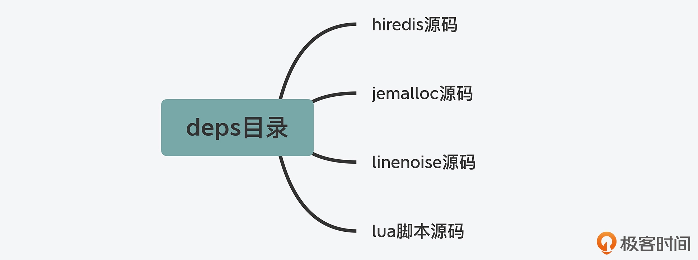
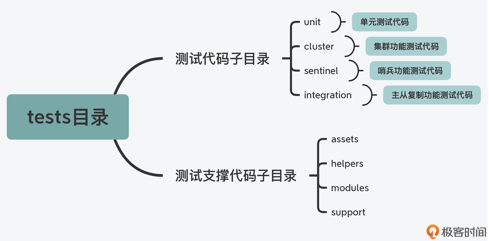
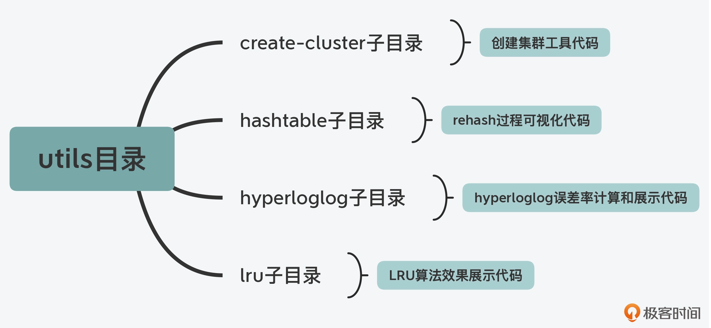
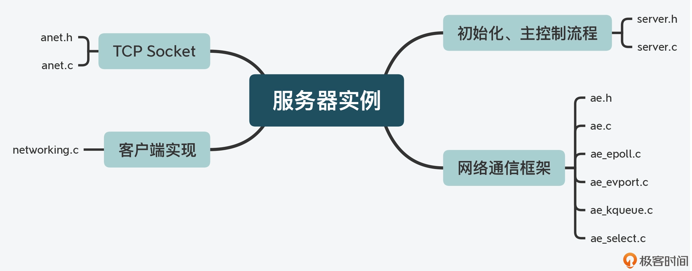
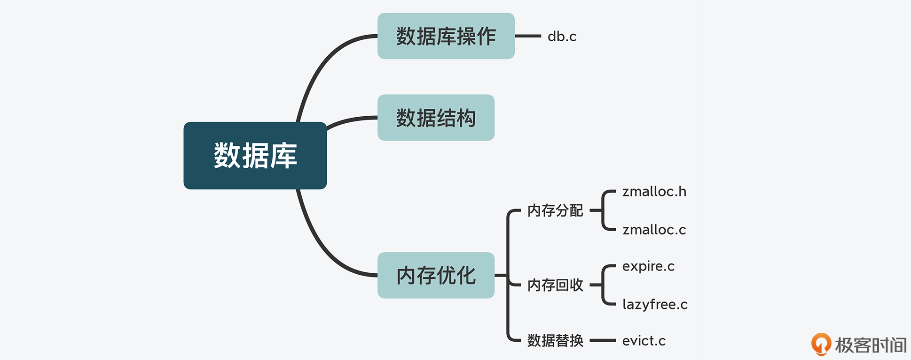

# redis源码学习
- [redis源码学习](#redis源码学习)
- [源码能给你带来什么](#源码能给你带来什么)
  - [学习计算机系统设计思想](#学习计算机系统设计思想)
  - [如何正确学习 Redis 源码](#如何正确学习-redis-源码)
  - [这门课程是怎样设计的？](#这门课程是怎样设计的)
- [源码的整体架构](#源码的整体架构)
- [Redis 目录结构](#redis-目录结构)
  - [deps 目录](#deps-目录)
  - [src 目录](#src-目录)
  - [tests 目录](#tests-目录)
  - [utils 目录](#utils-目录)
  - [配置文件](#配置文件)
  - [Redis 源码的总体结构层次](#redis-源码的总体结构层次)
- [Redis 功能模块与源码对应](#redis-功能模块与源码对应)
  - [服务器实例](#服务器实例)
  - [数据库数据类型与操作](#数据库数据类型与操作)
    - [Redis 是如何优化内存使用的](#redis-是如何优化内存使用的)
  - [Redis 数据库数据类型与操作相关的功能模块及代码文件](#redis-数据库数据类型与操作相关的功能模块及代码文件)
  - [高可靠性和高可扩展性](#高可靠性和高可扩展性)
    - [数据持久化实现](#数据持久化实现)
    - [主从复制功能实现](#主从复制功能实现)
  - [辅助功能](#辅助功能)
  - [小结](#小结)
# 源码能给你带来什么
## 学习计算机系统设计思想
跟着 Redis 学习计算机系统的关键设计思想

## 如何正确学习 Redis 源码
“无从下手”的原因，是缺少了代码结构的全景图，而出现“无所适从”的问题，是缺少阅读目标的牵引和基本原理的支撑。简单来说，就是没有掌握科学、高效的代码阅读方法

1、高效阅读代码的第一个要点，是要先从整体上掌握源码的结构  
2、高效阅读代码的第二个要点，是一定要有目标牵引和原理支撑  
3、高效阅读代码的第三个要点，是要做到先主线逻辑再分支细节
## 这门课程是怎样设计的？
说到 Redis 的功能特性，Redis 提供了 String、List、Hash、Set、Sorted Set 等丰富的数据类型，同时，Redis 的访问性能高，还能构建成主从集群、切片集群来分别提升 Redis 使用的可靠性和可扩展性  
因此，针对 Redis 的上述功能特性，我把这门课程分成五大模块，具体如下
- 数据结构：你将学习到 Redis 主要数据结构的设计思想和实现，包括字符串的实现方法、内存紧凑型结构的设计、哈希表性能优化设计，以及 ziplist、quicklist、listpack、跳表的设计与实现等
- 网络通信与执行模型：你将掌握 Redis server 的启动流程、高性能网络通信设计与实现、事件驱动框架的设计与实现、Redis 线程类型的设计和优化等
- 缓存：你将了解常见缓存替换算法如何从原理转变为代码
- 可靠性保证：你将掌握 RDB、AOF 的具体实现，分布式系统中 Raft 一致性协议的设计实现，故障切换的关键代码实现等
- 切片集群：你将学习到 Redis 切片集群中关键机制的设计与实现，包括 Gossip 通信协议、请求重定向、数据迁移等
# 源码的整体架构
如何学习 Redis 的代码架构呢？我的建议是要掌握以下两方面内容：
- 代码的目录结构和作用划分，目的是理解 Redis 代码的整体架构，以及所包含的代码功能类别；
- 系统功能模块与对应代码文件，目的是了解 Redis 实例提供的各项功能及其相应的实现文件，以便后续深入学习
# Redis 目录结构
它的源码总目录下，一共包含了deps、src、tests、utils四个子目录
## deps 目录
这个目录主要包含了 Redis 依赖的第三方代码库，包括 Redis 的 C 语言版本客户端代码 hiredis、jemalloc 内存分配器代码、readline 功能的替代代码 linenoise，以及 lua 脚本代码

为什么在 Redis 源码结构中会有第三方代码库目录呢？其实主要有两方面的原因。
- 一方面，Redis 作为一个用 C 语言写的用户态程序，它的不少功能是依赖于标准的 glibc 库提供的，比如内存分配、行读写（readline）、文件读写、子进程 / 线程创建等。但是，glibc 库提供的某些功能实现，效率并不高
- 另一方面，有些功能是 Redis 运行所需要的，但是这部分功能又会独立于 Redis 进行开发和演进。这种类型最为典型的功能代码，就是 Redis 的客户端代码
## src 目录
这个目录里面包含了 Redis 所有功能模块的代码文件，也是 Redis 源码的重要组成部分。同样，我们先来看下 src 目录下的子目录结构

## tests 目录
Redis 实现的测试代码可以分成四部分，分别是单元测试（对应 unit 子目录），Redis Cluster 功能测试（对应 cluster 子目录）、哨兵功能测试（对应 sentinel 子目录）、主从复制功能测试（对应 integration 子目录）。这些子目录中的测试代码使用了 Tcl 语言（通用的脚本语言）进行编写，主要目的就是方便进行测试

## utils 目录
在 Redis 开发过程中，还有一些功能属于辅助性功能，包括用于创建 Redis Cluster 的脚本、用于测试 LRU 算法效果的程序，以及可视化 rehash 过程的程序。在 Redis 代码结构中，这些功能代码都被归类到了 utils 目录中统一管理

## 配置文件
Redis 源码总目录下包含了两个重要的配置文件，一个是 Redis 实例的配置文件 redis.conf，另一个是哨兵的配置文件 sentinel.conf
## Redis 源码的总体结构层次

# Redis 功能模块与源码对应
基于 Redis 5.0.8 版本  
Redis 代码结构中的 src 目录，包含了实现功能模块的 123 个代码文件。在这 123 个代码文件中，对于某个功能来说，一般包括了实现该功能的 C 语言文件（.c 文件） 和对应的头文件（.h 文件）。比如，dict.c 和 dict.h 就是用于实现哈希表的 C 文件和头文件  
Redis 代码文件的命名非常规范，文件名中就体现了该文件实现的主要功能。比如，对于 rdb.h 和 rdb.c 这两个代码文件来说，从文件名上，你就可以看出来它们是实现内存快照 RDB 的对应代码  
分别按照 Redis 的服务器实例、数据库操作、可靠性和可扩展性保证、辅助功能四个维度，把 Redis 功能源码梳理成了四条代码路径  
## 服务器实例
Redis 在运行时是一个网络服务器实例，因此相应地就需要有代码实现服务器实例的初始化和主体控制流程，而这是由 server.h/server.c 实现的，Redis 整个代码的 main 入口函数也是在 server.c 中  
对于一个网络服务器来说，它还需要提供网络通信功能。Redis 使用了基于事件驱动机制的网络通信框架，涉及的代码文件包括 ae.h/ae.c，ae_epoll.c，ae_evport.c，ae_kqueue.c，ae_select.c  
而除了事件驱动网络框架以外，与网络通信相关的功能还包括底层 TCP 网络通信和客户端实现  
Redis 对 TCP 网络通信的 Socket 连接、设置等操作进行了封装，这些封装后的函数实现在 anet.h/anet.c 中。这些函数在 Redis Cluster 创建和主从复制的过程中，会被调用并用于建立 TCP 连接  
除此之外，客户端在 Redis 的运行过程中也会被广泛使用，比如实例返回读取的数据、主从复制时在主从库间传输数据、Redis Cluster 的切片实例通信等，都会用到客户端。Redis 将客户端的创建、消息回复等功能，实现在了 networking.c 文件中  
服务器实例相关的功能模块及对应的代码文件

## 数据库数据类型与操作
Redis 实现的底层数据结构非常多，所以这里把这些底层结构和它们对应的键值对类型，以及相应的代码文件列在了下表中

除了实现了诸多的数据类型以外，Redis 作为数据库，还实现了对键值对的新增、查询、修改和删除等操作接口，这部分功能是在 db.c 文件实现的
### Redis 是如何优化内存使用的
Redis 是从三个方面来优化内存使用的，分别是内存分配、内存回收，以及数据替换
- 首先，在内存分配方面，Redis 支持使用不同的内存分配器，包括 glibc 库提供的默认分配器 tcmalloc、第三方库提供的 jemalloc。Redis 把对内存分配器的封装实现在了 zmalloc.h/zmalloc.c。
- 其次，在内存回收上，Redis 支持设置过期 key，并针对过期 key 可以使用不同删除策略，这部分代码实现在 expire.c 文件中。同时，为了避免大量 key 删除回收内存，会对系统性能产生影响，Redis 在 lazyfree.c 中实现了异步删除的功能，所以这样，我们就可以使用后台 IO 线程来完成删除，以避免对 Redis 主线程的影响
- 最后，针对数据替换，如果内存满了，Redis 还会按照一定规则清除不需要的数据，这也是 Redis 可以作为缓存使用的原因。Redis 实现的数据替换策略有很多种，包括 LRU、LFU 等经典算法。这部分的代码实现在了 evict.c 中
## Redis 数据库数据类型与操作相关的功能模块及代码文件

## 高可靠性和高可扩展性
### 数据持久化实现
Redis 的数据持久化实现有两种方式：内存快照 RDB 和 AOF 日志，分别实现在了 rdb.h/rdb.c 和 aof.c 中  
注意，在使用 RDB 或 AOF 对数据库进行恢复时，RDB 和 AOF 文件可能会因为 Redis 实例所在服务器宕机，而未能完整保存，进而会影响到数据库恢复。因此针对这一问题，Redis 还实现了对这两类文件的检查功能，对应的代码文件分别是 redis-check-rdb.c 和 redis-check-aof.c。
### 主从复制功能实现
Redis 把主从复制功能实现在了 replication.c 文件中。另外你还需要知道的是，Redis 的主从集群在进行恢复时，主要是依赖于哨兵机制，而这部分功能则直接实现在了 sentinel.c 文件中  
其次，与 Redis 实现高可靠性保证的功能类似，Redis 高可扩展性保证的功能，是通过 Redis Cluster 来实现的，这部分代码也非常集中，就是在 cluster.h/cluster.c 代码文件中
## 辅助功能
Redis 在 latency.h/latency.c 中实现了操作延迟监控的功能；为了便于运维人员查找运行过慢的操作命令，Redis 在 slowlog.h/slowlog.c 中实现了慢命令的记录功能，等等  
运维人员有时还需要了解 Redis 的性能表现，为了支持这一目标，Redis 实现了对系统进行性能评测的功能，这部分代码在 redis-benchmark.c 中
## 小结
通过目录命名和层次，来快速掌握一个系统软件的代码结构  
