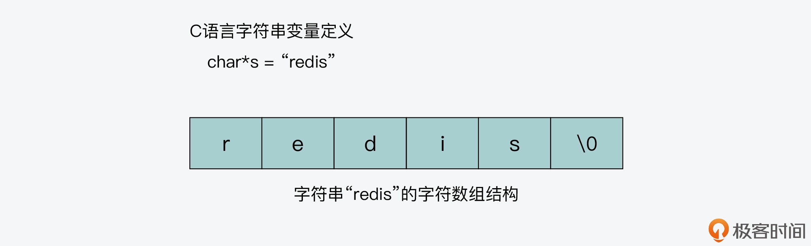

- [键值对中字符串的实现，用char\*还是结构体](#键值对中字符串的实现用char还是结构体)
  - [char\* 的结构设计](#char-的结构设计)
  - [操作函数复杂度](#操作函数复杂度)
  - [SDS 的设计思想](#sds-的设计思想)
  - [SDS 结构设计](#sds-结构设计)
  - [SDS 操作效率](#sds-操作效率)
  - [紧凑型字符串结构的编程技巧](#紧凑型字符串结构的编程技巧)
  - [小结](#小结)
- [如何实现一个性能优异的Hash表](#如何实现一个性能优异的hash表)
  - [什么是哈希冲突](#什么是哈希冲突)
  - [链式哈希如何设计与实现](#链式哈希如何设计与实现)
  - [Redis 如何实现 rehash](#redis-如何实现-rehash)
  - [什么时候触发 rehash](#什么时候触发-rehash)
  - [rehash 扩容扩多大](#rehash-扩容扩多大)
  - [渐进式 rehash 如何实现](#渐进式-rehash-如何实现)
  - [小结](#小结-1)

# 键值对中字符串的实现，用char*还是结构体
Redis 设计了简单动态字符串（Simple Dynamic String，SDS）的结构，用来表示字符串。相比于 C 语言中的字符串实现，SDS 这种字符串的实现方式，会提升字符串的操作效率，并且可以用来保存二进制数据
## char* 的结构设计
char*字符数组的结构很简单，就是一块连续的内存空间，依次存放了字符串中的每一个字符。比如，下图显示的就是字符串“redis”的char*数组结构

从图中可以看到，字符数组的最后一个字符是“\0”，这个字符的作用是什么呢？其实，C 语言在对字符串进行操作时，char* 指针只是指向字符数组的起始位置，而字符数组的结尾位置就用“\0”表示，意思是指字符串的结束  
这样一来，C 语言标准库中字符串的操作函数，就会通过检查字符数组中是否有“\0”，来判断字符串是否结束。比如，strlen 函数就是一种字符串操作函数，它可以返回一个字符串的长度。这个函数会遍历字符数组中的每一个字符，并进行计数，直到检查的字符为“\0”。此时，strlen 函数会停止计数，返回已经统计到的字符个数。下图显示了 strlen 函数的执行流程：

char* 字符串以“\0”表示字符串的结束，其实会给我们保存数据带来一定的负面影响。如果我们要保存的数据中，本身就有“\0”，那么数据在“\0”处就会被截断，而这就不符合 Redis 希望能保存任意二进制数据的需求
## 操作函数复杂度
strlen 函数为例，该函数需要遍历字符数组中的每一个字符，才能得到字符串长度，所以这个操作函数的复杂度是 O(N)  
strcat 函数和 strlen 函数类似，复杂度都很高，也都需要先通过遍历字符串才能得到目标字符串的末尾。然后对于 strcat 函数来说，还要再遍历源字符串才能完成追加。另外，它在把源字符串追加到目标字符串末尾时，还需要确认目标字符串具有足够的可用空间，否则就无法追加  
综合以上在 C 语言中使用 char* 实现字符串的两大不足之处以后，我们现在就需要找到新的实现字符串的方式了
## SDS 的设计思想
因为 Redis 是使用 C 语言开发的，所以为了保证能尽量复用 C 标准库中的字符串操作函数，Redis 保留了使用字符数组来保存实际的数据。但是，和 C 语言仅用字符数组不同，Redis 还专门设计了 SDS（即简单动态字符串）的数据结构
## SDS 结构设计
SDS 结构里包含了一个字符数组 buf[]，用来保存实际数据。同时，SDS 结构里还包含了三个元数据，分别是字符数组现有长度 len、分配给字符数组的空间长度 alloc，以及 SDS 类型 flags。其中，Redis 给 len 和 alloc 这两个元数据定义了多种数据类型，进而可以用来表示不同类型的 SDS

Redis 使用 typedef 给 char* 类型定义了一个别名，这个别名就是 sds  
```cpp
typedef char *sds;
```
其实，这是因为 SDS 本质还是字符数组，只是在字符数组基础上增加了额外的元数据。在 Redis 中需要用到字符数组时，就直接使用 sds 这个别名  
在创建新的字符串时，Redis 会调用 SDS 创建函数 sdsnewlen。sdsnewlen 函数会新建 sds 类型变量（也就是 char* 类型变量），并新建 SDS 结构体，把 SDS 结构体中的数组 buf[] 赋给 sds 类型变量。最后，sdsnewlen 函数会把要创建的字符串拷贝给 sds 变量。下面的代码就显示了 sdsnewlen 函数的这个操作逻辑
```cpp
sds sdsnewlen(const void *init, size_t initlen) {
    void *sh;  //指向SDS结构体的指针
    sds s;     //sds类型变量，即char*字符数组

    ...
    sh = s_malloc(hdrlen+initlen+1);   //新建SDS结构，并分配内存空间
    ...
    s = (char*)sh+hdrlen;              //sds类型变量指向SDS结构体中的buf数组，sh指向SDS结构体起始位置，hdrlen是SDS结构体中元数据的长度
    ...
    if (initlen && init)
        memcpy(s, init, initlen);    //将要传入的字符串拷贝给sds变量s
    s[initlen] = '\0';               //变量s末尾增加\0，表示字符串结束
    return s;
```
## SDS 操作效率
因为 SDS 结构中记录了字符数组已占用的空间和被分配的空间，这就比传统 C 语言实现的字符串能带来更高的操作效率  
Redis 中实现字符串追加的函数是 sds.c 文件中的 sdscatlen 函数。这个函数的参数一共有三个，分别是目标字符串 s、源字符串 t 和要追加的长度 len  
```cpp
sds sdscatlen(sds s, const void *t, size_t len) {
    //获取目标字符串s的当前长度
    size_t curlen = sdslen(s);
    //根据要追加的长度len和目标字符串s的现有长度，判断是否要增加新的空间
    s = sdsMakeRoomFor(s,len);
    if (s == NULL) return NULL;
    //将源字符串t中len长度的数据拷贝到目标字符串结尾
    memcpy(s+curlen, t, len);
    //设置目标字符串的最新长度：拷贝前长度curlen加上拷贝长度
    sdssetlen(s, curlen+len);
    //拷贝后，在目标字符串结尾加上\0
    s[curlen+len] = '\0';
    return s;
}
```
sdscatlen 的实现较为简单，其执行过程分为三步：
- 首先，获取目标字符串的当前长度，并调用 sdsMakeRoomFor 函数，根据当前长度和要追加的长度，判断是否要给目标字符串新增空间。这一步主要是保证，目标字符串有足够的空间接收追加的字符串
- 其次，在保证了目标字符串的空间足够后，将源字符串中指定长度 len 的数据追加到目标字符串
- 最后，设置目标字符串的最新长度

和 C 语言中的字符串操作相比，SDS 通过记录字符数组的使用长度和分配空间大小，避免了对字符串的遍历操作，降低了操作开销，进一步就可以帮助诸多字符串操作更加高效地完成，比如创建、追加、复制、比较等  
此外，SDS 把目标字符串的空间检查和扩容封装在了 sdsMakeRoomFor 函数中，并且在涉及字符串空间变化的操作中，如追加、复制等，会直接调用该函数
## 紧凑型字符串结构的编程技巧

SDS 结构中有一个元数据 flags，表示的是 SDS 类型。事实上，SDS 一共设计了 5 种类型，分别是 sdshdr5、sdshdr8、sdshdr16、sdshdr32 和 sdshdr64。这 5 种类型的主要区别就在于，它们数据结构中的字符数组现有长度 len 和分配空间长度 alloc，这两个元数据的数据类型不同  
因为 sdshdr5 这一类型 Redis 已经不再使用了，所以我们这里主要来了解下剩余的 4 种类型。以 sdshdr8 为例，它的定义如下所示：
```cpp
struct __attribute__ ((__packed__)) sdshdr8 {
    uint8_t len; /* 字符数组现有长度*/
    uint8_t alloc; /* 字符数组的已分配空间，不包括结构体和\0结束字符*/
    unsigned char flags; /* SDS类型*/
    char buf[]; /*字符数组*/
};
```
现有长度 len 和已分配空间 alloc 的数据类型都是 uint8_t。uint8_t 是 8 位无符号整型，会占用 1 字节的内存空间。当字符串类型是 sdshdr8 时，它能表示的字符数组长度（包括数组最后一位\0）不会超过 256 字节（2 的 8 次方等于 256）  
而对于 sdshdr16、sdshdr32、sdshdr64 三种类型来说，它们的 len 和 alloc 数据类型分别是 uint16_t、uint32_t、uint64_t，即它们能表示的字符数组长度，分别不超过 2 的 16 次方、32 次方和 64 次方。这两个元数据各自占用的内存空间在 sdshdr16、sdshdr32、sdshdr64 类型中，则分别是 2 字节、4 字节和 8 字节  
SDS 之所以设计不同的结构头（即不同类型），是为了能灵活保存不同大小的字符串，从而有效节省内存空间。因为在保存不同大小的字符串时，结构头占用的内存空间也不一样，这样一来，在保存小字符串时，结构头占用空间也比较少  
Redis 在编程上还使用了专门的编译优化来节省内存空间。在刚才介绍的 sdshdr8 结构定义中，我们可以看到，在 struct 和 sdshdr8 之间使用了__attribute__ ((__packed__))，如下所示：
```cpp
struct __attribute__ ((__packed__)) sdshdr8
```
__attribute__ ((__packed__))的作用就是告诉编译器，在编译 sdshdr8 结构时，不要使用字节对齐的方式，而是采用紧凑的方式分配内存。这是因为在默认情况下，编译器会按照 8 字节对齐的方式，给变量分配内存。也就是说，即使一个变量的大小不到 8 个字节，编译器也会给它分配 8 个字节
## 小结
这节课我主要给你介绍了 Redis 中字符串的设计与实现。你要知道，字符串的实现需要考虑操作高效、能保存任意二进制数据，以及节省内存的需求。而 Redis 中设计实现字符串的方式，就非常值得你学习和借鉴。  
因此这节课，你需要重点关注三个要点，分别是：
- C 语言中使用 char* 实现字符串的不足，主要是因为使用“\0”表示字符串结束，操作时需遍历字符串，效率不高，并且无法完整表示包含“\0”的数据，因而这就无法满足 
- Redis 的需求。Redis 中字符串的设计思想与实现方法。Redis 专门设计了 SDS 数据结构，在字符数组的基础上，增加了字符数组长度和分配空间大小等元数据。这样一来，需要基于字符串长度进行的追加、复制、比较等操作，就可以直接读取元数据，效率也就提升了。而且，SDS 不通过字符串中的“\0”字符判断字符串结束，而是直接将其作为二进制数据处理，可以用来保存图片等二进制数据
- SDS 中是通过设计不同 SDS 类型来表示不同大小的字符串，并使用__attribute__ ((__packed__))这个编程小技巧，来实现紧凑型内存布局，达到节省内存的目的。
# 如何实现一个性能优异的Hash表
针对哈希冲突，Redis 采用了链式哈希，在不扩容哈希表的前提下，将具有相同哈希值的数据链接起来，以便这些数据在表中仍然可以被查询到；对于 rehash 开销，Redis 实现了渐进式 rehash 设计，进而缓解了 rehash 操作带来的额外开销对系统的性能影响。
## 什么是哈希冲突

该如何解决哈希冲突呢？可以考虑使用以下两种解决方案：
- 第一种方案，就是我接下来要给你介绍的链式哈希。这里你需要先知道，链式哈希的链不能太长，否则会降低 Hash 表性能。
- 第二种方案，就是当链式哈希的链长达到一定长度时，我们可以使用 rehash。不过，执行 rehash 本身开销比较大，所以就需要采用我稍后会给你介绍的渐进式 rehash 设计。
## 链式哈希如何设计与实现
需要了解 Redis 源码中对 Hash 表的实现。Redis 中和 Hash 表实现相关的文件主要是 dict.h 和 dict.c。其中，dict.h 文件定义了 Hash 表的结构、哈希项，以及 Hash 表的各种操作函数，而 dict.c 文件包含了 Hash 表各种操作的具体实现代码。  
在 dict.h 文件中，Hash 表被定义为一个二维数组（dictEntry **table），这个数组的每个元素是一个指向哈希项（dictEntry）的指针。下面的代码展示的就是在 dict.h 文件中对 Hash 表的定义，可以看下
```cpp
typedef struct dictht {
    dictEntry **table; //二维数组
    unsigned long size; //Hash表大小
    unsigned long sizemask;
    unsigned long used;
} dictht;
```
为了实现链式哈希， Redis 在每个 dictEntry 的结构设计中，除了包含指向键和值的指针，还包含了指向下一个哈希项的指针。如下面的代码所示，dictEntry 结构体中包含了指向另一个 dictEntry 结构的指针 *next，这就是用来实现链式哈希的：
```cpp
typedef struct dictEntry {
    void *key;
    union {
        void *val;
        uint64_t u64;
        int64_t s64;
        double d;
    } v;
    struct dictEntry *next;
} dictEntry;
```
有一个值得注意的地方，就是在 dictEntry 结构体中，键值对的值是由一个联合体 v 定义的。这个联合体 v 中包含了指向实际值的指针 *val，还包含了无符号的 64 位整数、有符号的 64 位整数，以及 double 类的值  
这种实现方法是一种节省内存的开发小技巧，非常值得学习
为什么这种链式哈希可以帮助解决哈希冲突呢

## Redis 如何实现 rehash
rehash 操作，其实就是指扩大 Hash 表空间。而 Redis 实现 rehash 的基本思路是这样的：
- 首先，Redis 准备了两个哈希表，用于 rehash 时交替保存数据  
Redis 在 dict.h 文件中使用 dictht 结构体定义了 Hash 表。不过，在实际使用 Hash 表时，Redis 又在 dict.h 文件中，定义了一个 dict 结构体。这个结构体中有一个数组（ht[2]），包含了两个 Hash 表 ht[0]和 ht[1]。dict 结构体的代码定义如下所示：
```cpp
typedef struct dict {
    …
    dictht ht[2]; //两个Hash表，交替使用，用于rehash操作
    long rehashidx; //Hash表是否在进行rehash的标识，-1表示没有进行rehash
    …
} dict;
```
- 其次，在正常服务请求阶段，所有的键值对写入哈希表 ht[0]
- 接着，当进行 rehash 时，键值对被迁移到哈希表 ht[1]中
- 最后，当迁移完成后，ht[0]的空间会被释放，并把 ht[1]的地址赋值给 ht[0]，ht[1]的表大小设置为 0。这样一来，又回到了正常服务请求的阶段，ht[0]接收和服务请求，ht[1]作为下一次 rehash 时的迁移表

需要明确的是：在实现 rehash 时，都需要解决哪些问题？我认为主要有以下三点：什么时候触发 rehash？rehash 扩容扩多大？rehash 如何执行？
## 什么时候触发 rehash
首先要知道，Redis 用来判断是否触发 rehash 的函数是 _dictExpandIfNeeded。所以接下来我们就先看看，_dictExpandIfNeeded 函数中进行扩容的触发条件；然后，我们再来了解下 _dictExpandIfNeeded 又是在哪些函数中被调用的  
实际上，_dictExpandIfNeeded 函数中定义了三个扩容条件  
- 条件一：ht[0]的大小为 0。
- 条件二：ht[0]承载的元素个数已经超过了 ht[0]的大小，同时 Hash 表可以进行扩容。
- 条件三：ht[0]承载的元素个数，是 ht[0]的大小的 dict_force_resize_ratio 倍，其中，dict_force_resize_ratio 的默认值是 5
下面的代码就展示了 _dictExpandIfNeeded 函数对这三个条件的定义
```cpp
//如果Hash表为空，将Hash表扩为初始大小
if (d->ht[0].size == 0) 
   return dictExpand(d, DICT_HT_INITIAL_SIZE);
 
//如果Hash表承载的元素个数超过其当前大小，并且可以进行扩容，或者Hash表承载的元素个数已是当前大小的5倍
if (d->ht[0].used >= d->ht[0].size &&(dict_can_resize ||
              d->ht[0].used/d->ht[0].size > dict_force_resize_ratio))
{
    return dictExpand(d, d->ht[0].used*2);
}
```
对于条件一来说，此时 Hash 表是空的，所以 Redis 就需要将 Hash 表空间设置为初始大小，而这是初始化的工作，并不属于 rehash 操作  
条件二和三就对应了 rehash 的场景。因为在这两个条件中，都比较了 Hash 表当前承载的元素个数（d->ht[0].used）和 Hash 表当前设定的大小（d->ht[0].size），这两个值的比值一般称为负载因子（load factor）。也就是说，Redis 判断是否进行 rehash 的条件，就是看 load factor 是否大于等于 1 和是否大于 5  
实际上，当 load factor 大于 5 时，就表明 Hash 表已经过载比较严重了，需要立刻进行库扩容。而当 load factor 大于等于 1 时，Redis 还会再判断 dict_can_resize 这个变量值，查看当前是否可以进行扩容  
dict_can_resize 变量值是啥呀？其实，这个变量值是在 dictEnableResize 和 dictDisableResize 两个函数中设置的，它们的作用分别是启用和禁止哈希表执行 rehash 功能，如下所示：
```cpp
void dictEnableResize(void) {
    dict_can_resize = 1;
}
 
void dictDisableResize(void) {
    dict_can_resize = 0;
}
```
然后，这两个函数又被封装在了 updateDictResizePolicy 函数中  
updateDictResizePolicy 函数是用来启用或禁用 rehash 扩容功能的，这个函数调用 dictEnableResize 函数启用扩容功能的条件是：当前没有 RDB 子进程，并且也没有 AOF 子进程。这就对应了 Redis 没有执行 RDB 快照和没有进行 AOF 重写的场景。可以参考下面给出的代码：
```cpp
void updateDictResizePolicy(void) {
    if (server.rdb_child_pid == -1 && server.aof_child_pid == -1)
        dictEnableResize();
    else
        dictDisableResize();
}
```
到这里我们就了解了 _dictExpandIfNeeded 对 rehash 的判断触发条件，那么现在，我们再来看下 Redis 会在哪些函数中，调用 _dictExpandIfNeeded 进行判断
首先，通过在dict.c文件中查看 _dictExpandIfNeeded 的被调用关系，我们可以发现，_dictExpandIfNeeded 是被 _dictKeyIndex 函数调用的，而 _dictKeyIndex 函数又会被 dictAddRaw 函数调用，然后 dictAddRaw 会被以下三个函数调用。
- dictAdd：用来往 Hash 表中添加一个键值对。
- dictRelace：用来往 Hash 表中添加一个键值对，或者键值对存在时，修改键值对。
- dictAddorFind：直接调用 dictAddRaw  
因此，当我们往 Redis 中写入新的键值对或是修改键值对时，Redis 都会判断下是否需要进行 rehash。这里你可以参考下面给出的示意图，其中就展示了 _dictExpandIfNeeded 被调用的关系

简而言之，Redis 中触发 rehash 操作的关键，就是 _dictExpandIfNeeded 函数和 updateDictResizePolicy 函数。_dictExpandIfNeeded 函数会根据 Hash 表的负载因子以及能否进行 rehash 的标识，判断是否进行 rehash，而 updateDictResizePolicy 函数会根据 RDB 和 AOF 的执行情况，启用或禁用 rehash
## rehash 扩容扩多大
在 Redis 中，rehash 对 Hash 表空间的扩容是通过调用 dictExpand 函数来完成的。dictExpand 函数的参数有两个，一个是要扩容的 Hash 表，另一个是要扩到的容量，下面的代码就展示了 dictExpand 函数的原型定义
```cpp
int dictExpand(dict *d, unsigned long size);
```
对于一个 Hash 表来说，我们就可以根据前面提到的 _dictExpandIfNeeded 函数，来判断是否要对其进行扩容。而一旦判断要扩容，Redis 在执行 rehash 操作时，对 Hash 表扩容的思路也很简单，就是如果当前表的已用空间大小为 size，那么就将表扩容到 size*2 的大小  
如下所示，当 _dictExpandIfNeeded 函数在判断了需要进行 rehash 后，就调用 dictExpand 进行扩容。这里你可以看到，rehash 的扩容大小是当前 ht[0]已使用大小的 2 倍
```cpp
dictExpand(d, d->ht[0].used*2);
```
在 dictExpand 函数中，具体执行是由 _dictNextPower 函数完成的，以下代码显示的 Hash 表扩容的操作，就是从 Hash 表的初始大小（DICT_HT_INITIAL_SIZE），不停地乘以 2，直到达到目标大小
```cpp

static unsigned long _dictNextPower(unsigned long size)
{
    //哈希表的初始大小
    unsigned long i = DICT_HT_INITIAL_SIZE;
    //如果要扩容的大小已经超过最大值，则返回最大值加1
    if (size >= LONG_MAX) return LONG_MAX + 1LU;
    //扩容大小没有超过最大值
    while(1) {
        //如果扩容大小大于等于最大值，就返回截至当前扩到的大小
        if (i >= size)
            return i;
        //每一步扩容都在现有大小基础上乘以2
        i *= 2;
    }
}
```
下面我们再来看看 Redis 要解决的第三个问题，即 rehash 要如何执行？而这个问题，本质上就是 Redis 要如何实现渐进式 rehash 设计
## 渐进式 rehash 如何实现
为什么要实现渐进式 rehash？  
其实这是因为，Hash 表在执行 rehash 时，由于 Hash 表空间扩大，原本映射到某一位置的键可能会被映射到一个新的位置上，因此，很多键就需要从原来的位置拷贝到新的位置。而在键拷贝时，由于 Redis 主线程无法执行其他请求，所以键拷贝会阻塞主线程，这样就会产生 rehash 开销  
为了降低 rehash 开销，Redis 就提出了渐进式 rehash 的方法  
简单来说，渐进式 rehash 的意思就是 Redis 并不会一次性把当前 Hash 表中的所有键，都拷贝到新位置，而是会分批拷贝，每次的键拷贝只拷贝 Hash 表中一个 bucket 中的哈希项。这样一来，每次键拷贝的时长有限，对主线程的影响也就有限了  
渐进式 rehash 在代码层面是如何实现的呢？这里有两个关键函数：dictRehash 和 _dictRehashStep  
我们先来看 dictRehash 函数，这个函数实际执行键拷贝，它的输入参数有两个，分别是全局哈希表（即前面提到的 dict 结构体，包含了 ht[0]和 ht[1]）和需要进行键拷贝的桶数量（bucket 数量）  
dictRehash 函数的整体逻辑包括两部分：
- 首先，该函数会执行一个循环，根据要进行键拷贝的 bucket 数量 n，依次完成这些 bucket 内部所有键的迁移。当然，如果 ht[0]哈希表中的数据已经都迁移完成了，键拷贝的循环也会停止执行。
- 其次，在完成了 n 个 bucket 拷贝后，dictRehash 函数的第二部分逻辑，就是判断 ht[0]表中数据是否都已迁移完。如果都迁移完了，那么 ht[0]的空间会被释放。因为 Redis 在处理请求时，代码逻辑中都是使用 ht[0]，所以当 rehash 执行完成后，虽然数据都在 ht[1]中了，但 Redis 仍然会把 ht[1]赋值给 ht[0]，以便其他部分的代码逻辑正常使用。
- 而在 ht[1]赋值给 ht[0]后，它的大小就会被重置为 0，等待下一次 rehash。与此同时，全局哈希表中的 rehashidx 变量会被标为 -1，表示 rehash 结束了（这里的 rehashidx 变量用来表示 rehash 的进度，稍后我会给你具体解释）  
dictRehash 的主要执行流程

也可以通过下面代码，来了解 dictRehash 函数的主要执行逻辑
```cpp
int dictRehash(dict *d, int n) {
    int empty_visits = n*10;
    ...
    //主循环，根据要拷贝的bucket数量n，循环n次后停止或ht[0]中的数据迁移完停止
    while(n-- && d->ht[0].used != 0) {
       ...
    }
    //判断ht[0]的数据是否迁移完成
    if (d->ht[0].used == 0) {
        //ht[0]迁移完后，释放ht[0]内存空间
        zfree(d->ht[0].table);
        //让ht[0]指向ht[1]，以便接受正常的请求
        d->ht[0] = d->ht[1];
        //重置ht[1]的大小为0
        _dictReset(&d->ht[1]);
        //设置全局哈希表的rehashidx标识为-1，表示rehash结束
        d->rehashidx = -1;
        //返回0，表示ht[0]中所有元素都迁移完
        return 0;
    }
    //返回1，表示ht[0]中仍然有元素没有迁移完
    return 1;
}
```
了解了 dictRehash 函数的主体逻辑后，我们再看下渐进式 rehash 是如何按照 bucket 粒度拷贝数据的，这其实就和全局哈希表 dict 结构中的 rehashidx 变量相关了  
rehashidx 变量表示的是当前 rehash 在对哪个 bucket 做数据迁移。比如，当 rehashidx 等于 0 时，表示对 ht[0]中的第一个 bucket 进行数据迁移；当 rehashidx 等于 1 时，表示对 ht[0]中的第二个 bucket 进行数据迁移，以此类推  
而 dictRehash 函数的主循环，首先会判断 rehashidx 指向的 bucket 是否为空，如果为空，那就将 rehashidx 的值加 1，检查下一个 bucket  
那么，有没有可能连续几个 bucket 都为空呢？其实是有可能的，在这种情况下，渐进式 rehash 不会一直递增 rehashidx 进行检查。这是因为一旦执行了 rehash，Redis 主线程就无法处理其他请求了  
所以，渐进式 rehash 在执行时设置了一个变量 empty_visits，用来表示已经检查过的空 bucket，当检查了一定数量的空 bucket 后，这一轮的 rehash 就停止执行，转而继续处理外来请求，避免了对 Redis 性能的影响。下面的代码显示了这部分逻辑
```cpp
while(n-- && d->ht[0].used != 0) {
    //如果当前要迁移的bucket中没有元素
    while(d->ht[0].table[d->rehashidx] == NULL) {
        //
        d->rehashidx++;
        if (--empty_visits == 0) return 1;
    }
    ...
}
```
这样，每做完一个哈希项的迁移，ht[0]和 ht[1]用来表示承载哈希项多少的变量 used，就会分别减一和加一。当然，如果当前 rehashidx 指向的 bucket 中数据都迁移完了，rehashidx 就会递增加 1，指向下一个 bucket。下面的代码显示了这一迁移过程
```cpp
while(n-- && d->ht[0].used != 0) {
    ...
    //获得哈希表中哈希项
    de = d->ht[0].table[d->rehashidx];
    //如果rehashidx指向的bucket不为空
    while(de) {
        uint64_t h;
        //获得同一个bucket中下一个哈希项
        nextde = de->next;
        //根据扩容后的哈希表ht[1]大小，计算当前哈希项在扩容后哈希表中的bucket位置
        h = dictHashKey(d, de->key) & d->ht[1].sizemask;
        //将当前哈希项添加到扩容后的哈希表ht[1]中
        de->next = d->ht[1].table[h];
        d->ht[1].table[h] = de;
        //减少当前哈希表的哈希项个数
        d->ht[0].used--;
        //增加扩容后哈希表的哈希项个数
        d->ht[1].used++;
        //指向下一个哈希项
        de = nextde;
    }
    //如果当前bucket中已经没有哈希项了，将该bucket置为NULL
    d->ht[0].table[d->rehashidx] = NULL;
    //将rehash加1，下一次将迁移下一个bucket中的元素
    d->rehashidx++;
}
```
到这里，我们就已经基本了解了 dictRehash 函数的全部逻辑  
现在我们知道，dictRehash 函数本身是按照 bucket 粒度执行哈希项迁移的，它内部执行的 bucket 迁移个数，主要由传入的循环次数变量 n 来决定。但凡 Redis 要进行 rehash 操作，最终都会调用 dictRehash 函数  
接下来，我们来学习和渐进式 rehash 相关的第二个关键函数 _dictRehashStep，这个函数实现了每次只对一个 bucket 执行 rehash  
从 Redis 的源码中我们可以看到，一共会有 5 个函数通过调用 _dictRehashStep 函数，进而调用 dictRehash 函数，来执行 rehash，它们分别是：dictAddRaw，dictGenericDelete，dictFind，dictGetRandomKey，dictGetSomeKeys  
其中，dictAddRaw 和 dictGenericDelete 函数，分别对应了往 Redis 中增加和删除键值对，而后三个函数则对应了在 Redis 中进行查询操作。下图展示了这些函数间的调用关系：

要注意，不管是增删查哪种操作，这 5 个函数调用的 _dictRehashStep 函数，给 dictRehash 传入的循环次数变量 n 的值都为 1，下面的代码就显示了这一传参的情况
```cpp
static void _dictRehashStep(dict *d) {
//给dictRehash传入的循环次数参数为1，表明每迁移完一个bucket ，就执行正常操作
    if (d->iterators == 0) dictRehash(d,1);
}
```
这样一来，每次迁移完一个 bucket，Hash 表就会执行正常的增删查请求操作，这就是在代码层面实现渐进式 rehash 的方法
## 小结
实现一个高性能的 Hash 表不仅是 Redis 的需求，也是很多计算机系统开发过程中的重要目标。而要想实现一个性能优异的 Hash 表，就需要重点解决哈希冲突和 rehash 开销这两个问题  

