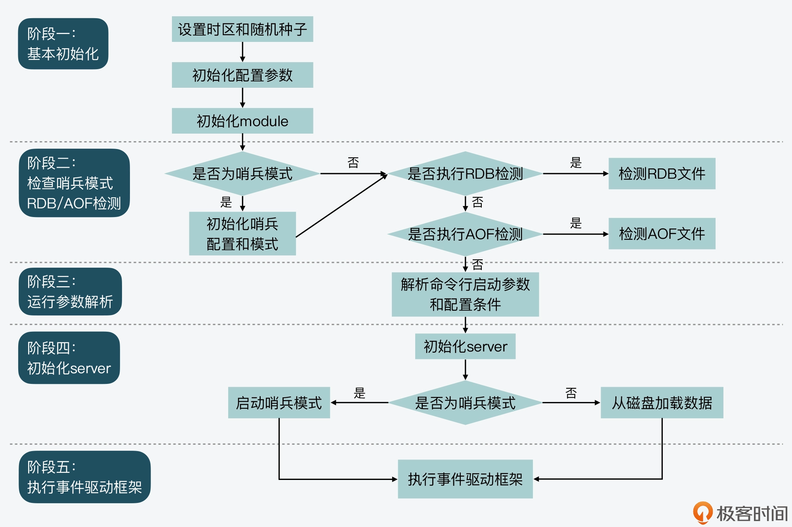
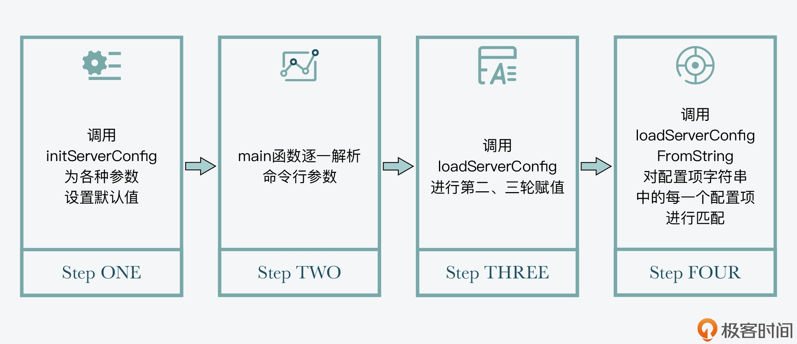
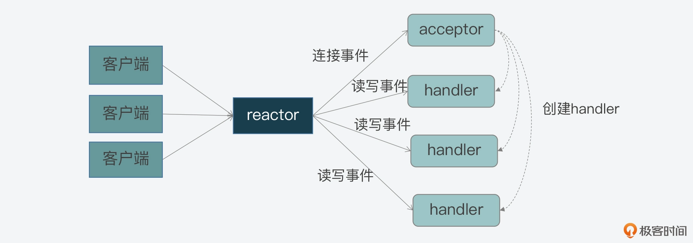
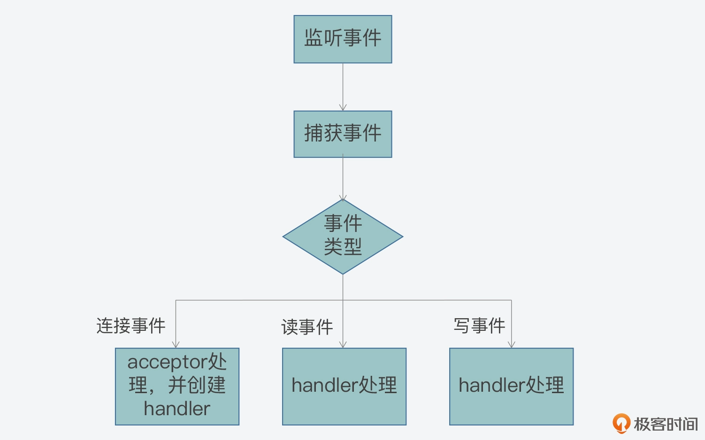
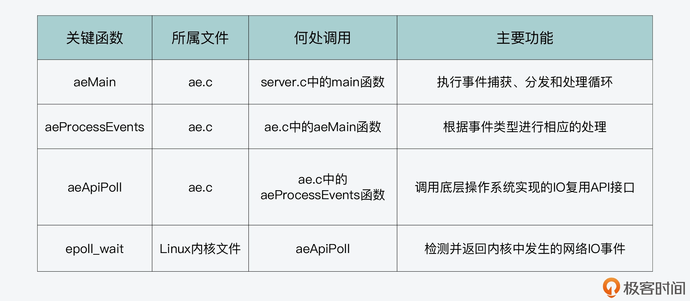

- [1 Redis server启动后会做哪些操作](#1-redis-server启动后会做哪些操作)
  - [main 函数：Redis server 的入口](#main-函数redis-server-的入口)
    - [阶段一：基本初始化](#阶段一基本初始化)
    - [阶段二：检查哨兵模式，并检查是否要执行 RDB 检测或 AOF 检测](#阶段二检查哨兵模式并检查是否要执行-rdb-检测或-aof-检测)
    - [阶段三：运行参数解析](#阶段三运行参数解析)
    - [阶段四：初始化 server](#阶段四初始化-server)
    - [阶段五：执行事件驱动框架](#阶段五执行事件驱动框架)
  - [Redis 运行参数解析与设置](#redis-运行参数解析与设置)
  - [Redis 的主要参数类型](#redis-的主要参数类型)
  - [Redis 参数的设置方法](#redis-参数的设置方法)
  - [initServer：初始化 Redis server](#initserver初始化-redis-server)
  - [执行事件驱动框](#执行事件驱动框)
  - [小结](#小结)
- [3 Redis事件驱动框架（中）：Redis实现了Reactor模型吗](#3-redis事件驱动框架中redis实现了reactor模型吗)
  - [Reactor 模型的工作机制](#reactor-模型的工作机制)
  - [事件类型与关键角色](#事件类型与关键角色)
  - [事件驱动框架](#事件驱动框架)
  - [Redis 对 Reactor 模型的实现](#redis-对-reactor-模型的实现)
  - [事件的数据结构定义：以 aeFileEvent 为例](#事件的数据结构定义以-aefileevent-为例)
  - [主循环：aeMain 函数](#主循环aemain-函数)
  - [事件捕获与分发：aeProcessEvents 函数](#事件捕获与分发aeprocessevents-函数)
  - [那么，aeApiPoll 是如何捕获事件呢](#那么aeapipoll-是如何捕获事件呢)
  - [事件注册：aeCreateFileEvent 函数](#事件注册aecreatefileevent-函数)
  - [小结](#小结-1)
- [4 Redis事件驱动框架（下）：Redis有哪些事件](#4-redis事件驱动框架下redis有哪些事件)
  - [aeEventLoop 结构体与初始化](#aeeventloop-结构体与初始化)
  - [aeCreateEventLoop 函数的初始化操作](#aecreateeventloop-函数的初始化操作)
  - [IO 事件处理](#io-事件处理)
  - [IO 事件创建](#io-事件创建)
  - [读事件处理](#读事件处理)
  - [写事件处理](#写事件处理)
  - [时间事件处理](#时间事件处理)
  - [时间事件定义](#时间事件定义)
  - [时间事件创建](#时间事件创建)
  - [时间事件回调函数](#时间事件回调函数)
  - [时间事件的触发处理](#时间事件的触发处理)
  - [小结](#小结-2)
- [6 Redis 6.0多IO线程的效率提高了吗](#6-redis-60多io线程的效率提高了吗)
  - [多IO线程的初始化](#多io线程的初始化)
  - [IO 线程的运行函数 IOThreadMain](#io-线程的运行函数-iothreadmain)
  - [如何推迟客户端读操作](#如何推迟客户端读操作)
  - [如何推迟客户端写操作](#如何推迟客户端写操作)
  - [如何把待读客户端分配给 IO 线程执行](#如何把待读客户端分配给-io-线程执行)
  - [如何把待写客户端分配给 IO 线程执行](#如何把待写客户端分配给-io-线程执行)
  - [小结](#小结-3)
  - [每课一问](#每课一问)


# 1 Redis server启动后会做哪些操作
通过这节课内容的学习，你可以掌握 Redis 针对以下三个问题的实现思路：
- Redis server 启动后具体会做哪些初始化操作
- Redis server 初始化时有哪些关键配置项
- Redis server 如何开始处理客户端请求
## main 函数：Redis server 的入口
一般来说，一个使用 C 开发的系统软件启动运行的代码逻辑，都是实现在了 main 函数当中
### 阶段一：基本初始化
在这个阶段，main 函数主要是完成一些基本的初始化工作，包括设置 server 运行的时区、设置哈希函数的随机种子等。这部分工作的主要调用函数如下所示：
```cpp
//设置时区
setlocale(LC_COLLATE,"");
tzset();
...
//设置随机种子
char hashseed[16];
getRandomHexChars(hashseed,sizeof(hashseed));
dictSetHashFunctionSeed((uint8_t*)hashseed);
```
### 阶段二：检查哨兵模式，并检查是否要执行 RDB 检测或 AOF 检测
Redis server 启动后，可能是以哨兵模式运行的，而哨兵模式运行的 server 在参数初始化、参数设置，以及 server 启动过程中要执行的操作等方面，与普通模式 server 有所差别。所以，main 函数在执行过程中需要根据 Redis 配置的参数，检查是否设置了哨兵模式  
如果有设置哨兵模式的话，main 函数会调用 initSentinelConfig 函数，对哨兵模式的参数进行初始化设置，以及调用 initSentinel 函数，初始化设置哨兵模式运行的 server  
下面的代码展示了 main 函数中对哨兵模式的检查，以及对哨兵模式的初始化
```cpp
...
//判断server是否设置为哨兵模式
if (server.sentinel_mode) {
        initSentinelConfig();  //初始化哨兵的配置
        initSentinel();   //初始化哨兵模式
}
...
```
除了检查哨兵模式以外，main 函数还会检查是否要执行 RDB 检测或 AOF 检查，这对应了实际运行的程序是 redis-check-rdb 或 redis-check-aof。在这种情况下，main 函数会调用 redis_check_rdb_main 函数或 redis_check_aof_main 函数，检测 RDB 文件或 AOF 文件
```cpp
...
//如果运行的是redis-check-rdb程序，调用redis_check_rdb_main函数检测RDB文件
if (strstr(argv[0],"redis-check-rdb") != NULL)
   redis_check_rdb_main(argc,argv,NULL);
//如果运行的是redis-check-aof程序，调用redis_check_aof_main函数检测AOF文件
else if (strstr(argv[0],"redis-check-aof") != NULL)
   redis_check_aof_main(argc,argv);
...
```
### 阶段三：运行参数解析
在这一阶段，main 函数会对命令行传入的参数进行解析，并且调用 loadServerConfig 函数，对命令行参数和配置文件中的参数进行合并处理，然后为 Redis 各功能模块的关键参数设置合适的取值，以便 server 能高效地运行。
### 阶段四：初始化 server
在完成对运行参数的解析和设置后，main 函数会调用 initServer 函数，对 server 运行时的各种资源进行初始化工作。这主要包括了 server 资源管理所需的数据结构初始化、键值对数据库初始化、server 网络框架初始化等。  
而在调用完 initServer 后，main 函数还会再次判断当前 server 是否为哨兵模式。如果是哨兵模式，main 函数会调用 sentinelIsRunning 函数，设置启动哨兵模式。否则的话，main 函数会调用 loadDataFromDisk 函数，从磁盘上加载 AOF 或者是 RDB 文件，以便恢复之前的数据。
### 阶段五：执行事件驱动框架
为了能高效处理高并发的客户端连接请求，Redis 采用了事件驱动框架，来并发处理不同客户端的连接和读写请求。所以，main 函数执行到最后时，会调用 aeMain 函数进入事件驱动框架，开始循环处理各种触发的事件。

在这五个阶段当中，阶段三、四和五其实就包括了 Redis server 启动过程中的关键操作
## Redis 运行参数解析与设置
Redis 提供了丰富的功能，既支持多种键值对数据类型的读写访问，还支持数据持久化保存、主从复制、切片集群等。而这些功能的高效运行，其实都离不开相关功能模块的关键参数配置  
举例来说，Redis 为了节省内存，设计了内存紧凑型的数据结构来保存 Hash、Sorted Set 等键值对类型。但是在使用了内存紧凑型的数据结构之后，如果往数据结构存入的元素个数过多或元素过大的话，键值对的访问性能反而会受到影响。因此，为了平衡内存使用量和系统访问性能，我们就可以通过参数，来设置和调节内存紧凑型数据结构的使用条件  
也就是说，掌握这些关键参数的设置，可以帮助我们提升 Redis 实例的运行效率  
不过，Redis 的参数有很多，我们无法在一节课中掌握所有的参数设置。所以下面，我们可以先来学习下 Redis 的主要参数类型，这样就能对各种参数形成一个全面的了解。同时，我也会给你介绍一些和 server 运行关系密切的参数及其设置方法，以便你可以配置好这些参数，让 server 高效运行起来。
## Redis 的主要参数类型
首先，Redis 运行所需的各种参数，都统一定义在了server.h文件的 redisServer 结构体中。根据参数作用的范围，我把各种参数划分为了七大类型，包括通用参数、数据结构参数、网络参数、持久化参数、主从复制参数、切片集群参数、性能优化参数。具体你可以参考下面表格中的内容

## Redis 参数的设置方法
Redis 对运行参数的设置实际上会经过三轮赋值，分别是默认配置值、命令行启动参数，以及配置文件配置值  
首先，Redis 在 main 函数中会先调用 initServerConfig 函数，为各种参数设置默认值。参数的默认值统一定义在 server.h 文件中，都是以 CONFIG_DEFAULT 开头的宏定义变量。下面的代码显示的是部分参数的默认值
```cpp
#define CONFIG_DEFAULT_HZ        10   //server后台任务的默认运行频率         
#define CONFIG_MIN_HZ            1    // server后台任务的最小运行频率
#define CONFIG_MAX_HZ            500 // server后台任务的最大运行频率
#define CONFIG_DEFAULT_SERVER_PORT  6379  //server监听的默认TCP端口
#define CONFIG_DEFAULT_CLIENT_TIMEOUT  0  //客户端超时时间，默认为0，表示没有超时限制
```
在 server.h 中提供的默认参数值，一般都是典型的配置值。因此，如果你在部署使用 Redis 实例的过程中，对 Redis 的工作原理不是很了解，就可以使用代码中提供的默认配置
如果你对 Redis 各功能模块的工作机制比较熟悉的话，也可以自行设置运行参数。你可以在启动 Redis 程序时，在命令行上设置运行参数的值。比如，如果你想将 Redis server 监听端口从默认的 6379 修改为 7379，就可以在命令行上设置 port 参数为 7379
```sh
./redis-server --port 7379
```
这里，你需要注意的是，Redis 的命令行参数设置需要使用两个减号“–”来表示相应的参数名，否则的话，Redis 就无法识别所设置的运行参数  
Redis 在使用 initServerConfig 函数对参数设置默认配置值后，接下来，main 函数就会对 Redis 程序启动时的命令行参数进行逐一解析  
main 函数会把解析后的参数及参数值保存成字符串，接着，main 函数会调用 loadServerConfig 函数进行第二和第三轮的赋值
```cpp
int main(int argc, char **argv) {
…
//保存命令行参数
for (j = 0; j < argc; j++) server.exec_argv[j] = zstrdup(argv[j]);
…
if (argc >= 2) {
   …
   //对每个运行时参数进行解析
   while(j != argc) {
      …
   }
   …
   //
   loadServerConfig(configfile,options);
}
```
loadServerConfig 函数是在config.c文件中实现的，该函数是以 Redis 配置文件和命令行参数的解析字符串为参数，将配置文件中的所有配置项读取出来，形成字符串。紧接着，loadServerConfig 函数会把解析后的命令行参数，追加到配置文件形成的配置项字符串  
这样一来，配置项字符串就同时包含了配置文件中设置的参数，以及命令行设置的参数  
最后，loadServerConfig 函数会进一步调用 loadServerConfigFromString 函数，对配置项字符串中的每一个配置项进行匹配。一旦匹配成功，loadServerConfigFromString 函数就会按照配置项的值设置 server 的参数  
以下代码显示了 loadServerConfigFromString 函数的部分内容。这部分代码是使用了条件分支，来依次比较配置项是否是“timeout”和“tcp-keepalive”，如果匹配上了，就将 server 参数设置为配置项的值  
同时，代码还会检查配置项的值是否合理，比如是否小于 0。如果参数值不合理，程序在运行时就会报错。另外对于其他的配置项，loadServerConfigFromString 函数还会继续使用 elseif 分支进行判断
```cpp
loadServerConfigFromString(char *config) {
   …
   //参数名匹配，检查参数是否为“timeout“
   if (!strcasecmp(argv[0],"timeout") && argc == 2) {
            //设置server的maxidletime参数
  server.maxidletime = atoi(argv[1]);
  //检查参数值是否小于0，小于0则报错
            if (server.maxidletime < 0) {
                err = "Invalid timeout value"; goto loaderr;
            }
   }
  //参数名匹配，检查参数是否为“tcp-keepalive“
  else if (!strcasecmp(argv[0],"tcp-keepalive") && argc == 2) {
            //设置server的tcpkeepalive参数
  server.tcpkeepalive = atoi(argv[1]);
  //检查参数值是否小于0，小于0则报错
            if (server.tcpkeepalive < 0) {
                err = "Invalid tcp-keepalive value"; goto loaderr;
            }
   }
   …
}
```
Redis server 运行参数配置的步骤  

在完成参数配置后，main 函数会开始调用 initServer 函数，对 server 进行初始化
## initServer：初始化 Redis server
Redis server 的初始化操作，主要可以分成三个步骤
- 第一步，Redis server 运行时需要对多种资源进行管理  
比如说，和 server 连接的客户端、从库等，Redis 用作缓存时的替换候选集，以及 server 运行时的状态信息，这些资源的管理信息都会在 initServer 函数中进行初始化  
我给你举个例子，initServer 函数会创建链表来分别维护客户端和从库，并调用 evictionPoolAlloc 函数（在evict.c中）采样生成用于淘汰的候选 key 集合。同时，initServer 函数还会调用 resetServerStats 函数（在 server.c 中）重置 server 运行状态信息
- 第二步，在完成资源管理信息的初始化后，initServer 函数会对 Redis 数据库进行初始化  
因为一个 Redis 实例可以同时运行多个数据库，所以 initServer 函数会使用一个循环，依次为每个数据库创建相应的数据结构  
这个代码逻辑是实现在 initServer 函数中，它会为每个数据库执行初始化操作，包括创建全局哈希表，为过期 key、被 BLPOP 阻塞的 key、将被 PUSH 的 key 和被监听的 key 创建相应的信息表
```cpp
for (j = 0; j < server.dbnum; j++) {
        //创建全局哈希表
        server.db[j].dict = dictCreate(&dbDictType,NULL);
        //创建过期key的信息表
        server.db[j].expires = dictCreate(&keyptrDictType,NULL);
        //为被BLPOP阻塞的key创建信息表
        server.db[j].blocking_keys = dictCreate(&keylistDictType,NULL);
        //为将执行PUSH的阻塞key创建信息表
        server.db[j].ready_keys = dictCreate(&objectKeyPointerValueDictType,NULL);
        //为被MULTI/WATCH操作监听的key创建信息表
        server.db[j].watched_keys = dictCreate(&keylistDictType,NULL);
        …
    }
```
- 第三步，initServer 函数会为运行的 Redis server 创建事件驱动框架，并开始启动端口监听，用于接收外部请求  
注意，为了高效处理高并发的外部请求，initServer 在创建的事件框架中，针对每个监听 IP 上可能发生的客户端连接，都创建了监听事件，用来监听客户端连接请求。同时，initServer 为监听事件设置了相应的处理函数 acceptTcpHandler  
这样一来，只要有客户端连接到 server 监听的 IP 和端口，事件驱动框架就会检测到有连接事件发生，然后调用 acceptTcpHandler 函数来处理具体的连接。你可以参考以下代码中展示的处理逻辑
```cpp
//创建事件循环框架
server.el = aeCreateEventLoop(server.maxclients+CONFIG_FDSET_INCR);
…
//开始监听设置的网络端口
if (server.port != 0 &&
        listenToPort(server.port,server.ipfd,&server.ipfd_count) == C_ERR)
        exit(1);
…
//为server后台任务创建定时事件
if (aeCreateTimeEvent(server.el, 1, serverCron, NULL, NULL) == AE_ERR) {
        serverPanic("Can't create event loop timers.");
        exit(1);
}
…
//为每一个监听的IP设置连接事件的处理函数acceptTcpHandler
for (j = 0; j < server.ipfd_count; j++) {
        if (aeCreateFileEvent(server.el, server.ipfd[j], AE_READABLE,
            acceptTcpHandler,NULL) == AE_ERR)
       { … }
}
```
那么到这里，Redis server 在完成运行参数设置和初始化后，就可以开始处理客户端请求了。为了能持续地处理并发的客户端请求，server 在 main 函数的最后，会进入事件驱动循环机制。而这就是接下来，我们要了解的事件驱动框架的执行过程
## 执行事件驱动框
事件驱动框架是 Redis server 运行的核心。该框架一旦启动后，就会一直循环执行，每次循环会处理一批触发的网络读写事件。这节课，我们主要是学习 Redis 入口的 main 函数中，是如何转换到事件驱动框架进行执行的  
其实，进入事件驱动框架开始执行并不复杂，main 函数直接调用事件框架的主体函数 aeMain（在ae.c文件中）后，就进入事件处理循环了  
当然，在进入事件驱动循环前，main 函数会分别调用 aeSetBeforeSleepProc 和 aeSetAfterSleepProc 两个函数，来设置每次进入事件循环前 server 需要执行的操作，以及每次事件循环结束后 server 需要执行的操作。下面代码显示了这部分的执行逻辑
```cpp
int main(int argc, char **argv) {
    …
    aeSetBeforeSleepProc(server.el,beforeSleep);
    aeSetAfterSleepProc(server.el,afterSleep);
    aeMain(server.el);
  aeDeleteEventLoop(server.el);
  ...
}
```
## 小结
过 server.c 文件中 main 函数的设计和实现思路，了解了 Redis server 启动后的五个主要阶段。在这五个阶段中，运行参数解析、server 初始化和执行事件驱动框架则是 Redis sever 启动过程中的三个关键阶段。所以相应的，我们需要重点关注以下三个要点  
- 第一，main 函数是使用 initServerConfig 给 server 运行参数设置默认值，然后会解析命令行参数，并通过 loadServerConfig 读取配置文件参数值，将命令行参数追加至配置项字符串。最后，Redis 会调用 loadServerConfigFromString 函数，来完成配置文件参数和命令行参数的设置。
- 第二，在 Redis server 完成参数设置后，initServer 函数会被调用，用来初始化 server 资源管理的主要结构，同时会初始化数据库启动状态，以及完成 server 监听 IP 和端口的设置。
- 第三，一旦 server 可以接收外部客户端的请求后，main 函数会把程序的主体控制权，交给事件驱动框架的入口函数，也就 aeMain 函数。aeMain 函数会一直循环执行，处理收到的客户端请求。到此为止，server.c 中的 main 函数功能就已经全部完成了，程序控制权也交给了事件驱动循环框架，Redis 也就可以正常处理客户端请求了
---
实际上，Redis server 的启动过程从基本的初始化操作，到命令行和配置文件的参数解析设置，再到初始化 server 各种数据结构，以及最后的执行事件驱动框架，这是一个典型的网络服务器执行过程，你在开发网络服务器时，就可以作为参考  
而且，掌握了启动过程中的初始化操作，还可以帮你解答一些使用中的疑惑。比如，Redis 启动时是先读取 RDB 文件，还是先读取 AOF 文件。如果你了解了 Redis server 的启动过程，就可以从 loadDataFromDisk 函数中看到，Redis server 会先读取 AOF；而如果没有 AOF，则再读取 RDB  
所以，掌握 Redis server 启动过程，有助于你更好地了解 Redis 运行细节，这样当你遇到问题时，就知道还可以从启动过程中去溯源 server 的各种初始状态，从而助力你更好地解决问题
# 3 Redis事件驱动框架（中）：Redis实现了Reactor模型吗
Reactor 模型是高性能网络系统实现高并发请求处理的一个重要技术方案。掌握 Reactor 模型的设计思想与实现方法，除了可以应对面试题，还可以指导你设计和实现自己的高并发系统。当你要处理成千上万的网络连接时，就不会一筹莫展了
## Reactor 模型的工作机制
Reactor 模型就是网络服务器端用来处理高并发网络 IO 请求的一种编程模型。我把这个模型的特征用两个“三”来总结，也就是：
- 三类处理事件，即连接事件、写事件、读事件；
- 三个关键角色，即 reactor、acceptor、handler
## 事件类型与关键角色
看看这三类事件和 Reactor 模型的关系  
其实，Reactor 模型处理的是客户端和服务器端的交互过程，而这三类事件正好对应了客户端和服务器端交互过程中，不同类请求在服务器端引发的待处理事件：
- 当一个客户端要和服务器端进行交互时，客户端会向服务器端发送连接请求，以建立连接，这就对应了服务器端的一个连接事件
- 一旦连接建立后，客户端会给服务器端发送读请求，以便读取数据。服务器端在处理读请求时，需要向客户端写回数据，这对应了服务器端的写事件
- 无论客户端给服务器端发送读或写请求，服务器端都需要从客户端读取请求内容，所以在这里，读或写请求的读取就对应了服务器端的读事件
---
如下所示的图例中，就展示了客户端和服务器端在交互过程中，不同类请求和 Reactor 模型事件的对应关系

在了解了 Reactor 模型的三类事件后，你现在可能还有一个疑问：这三类事件是由谁来处理的呢
这其实就是模型中三个关键角色的作用了：
- 首先，连接事件由 acceptor 来处理，负责接收连接；acceptor 在接收连接后，会创建 handler，用于网络连接上对后续读写事件的处理；
- 其次，读写事件由 handler 处理；
- 最后，在高并发场景中，连接事件、读写事件会同时发生，所以，我们需要有一个角色专门监听和分配事件，这就是 reactor 角色。当有连接请求时，reactor 将产生的连接事件交由 acceptor 处理；当有读写请求时，reactor 将读写事件交由 handler 处理。
---
下图就展示了这三个角色之间的关系，以及它们和事件的关系

事实上，这三个角色都是 Reactor 模型中要实现的功能的抽象。当我们遵循 Reactor 模型开发服务器端的网络框架时，就需要在编程的时候，在代码功能模块中实现 reactor、acceptor 和 handler 的逻辑  
那么，现在我们已经知道，这三个角色是围绕事件的监听、转发和处理来进行交互的，那么在编程时，我们又该如何实现这三者的交互呢？这就离不开事件驱动框架了
## 事件驱动框架
所谓的事件驱动框架，就是在实现 Reactor 模型时，需要实现的代码整体控制逻辑。简单来说，事件驱动框架包括了两部分：一是事件初始化；二是事件捕获、分发和处理主循环  
事件初始化是在服务器程序启动时就执行的，它的作用主要是创建需要监听的事件类型，以及该类事件对应的 handler。而一旦服务器完成初始化后，事件初始化也就相应完成了，服务器程序就需要进入到事件捕获、分发和处理的主循环中  
在开发代码时，我们通常会用一个 while 循环来作为这个主循环。然后在这个主循环中，我们需要捕获发生的事件、判断事件类型，并根据事件类型，调用在初始化时创建好的事件 handler 来实际处理事件  
比如说，当有连接事件发生时，服务器程序需要调用 acceptor 处理函数，创建和客户端的连接。而当有读事件发生时，就表明有读或写请求发送到了服务器端，服务器程序就要调用具体的请求处理函数，从客户端连接中读取请求内容，进而就完成了读事件的处理。这里你可以参考下面给出的图例，其中显示了事件驱动框架的基本执行过程

那么到这里，你应该就已经了解了 Reactor 模型的基本工作机制：客户端的不同类请求会在服务器端触发连接、读、写三类事件，这三类事件的监听、分发和处理又是由 reactor、acceptor、handler 三类角色来完成的，然后这三类角色会通过事件驱动框架来实现交互和事件处理  
所以可见，实现一个 Reactor 模型的关键，就是要实现事件驱动框架。那么，如何开发实现一个事件驱动框架呢  
Redis 提供了一个简洁但有效的参考实现，非常值得我们学习，而且也可以用于自己的网络系统开发。下面，我们就一起来学习下 Redis 中对 Reactor 模型的实现
## Redis 对 Reactor 模型的实现
首先我们要知道的是，Redis 的网络框架实现了 Reactor 模型，并且自行开发实现了一个事件驱动框架。这个框架对应的 Redis 代码实现文件是ae.c，对应的头文件是ae.h  
前面我们已经知道，事件驱动框架的实现离不开事件的定义，以及事件注册、捕获、分发和处理等一系列操作。当然，对于整个框架来说，还需要能一直运行，持续地响应发生的事件  
那么由此，我们从 ae.h 头文件中就可以看到，Redis 为了实现事件驱动框架，相应地定义了事件的数据结构、框架主循环函数、事件捕获分发函数、事件和 handler 注册函数。所以接下来，我们就依次来了解学习下
## 事件的数据结构定义：以 aeFileEvent 为例
首先，我们要明确一点，就是在 Redis 事件驱动框架的实现当中，事件的数据结构是关联事件类型和事件处理函数的关键要素。而 Redis 的事件驱动框架定义了两类事件：IO 事件和时间事件，分别对应了客户端发送的网络请求和 Redis 自身的周期性操作  
不同类型事件的数据结构定义是不一样的。以 IO 事件 aeFileEvent 为例  
aeFileEvent 是一个结构体，它定义了 4 个成员变量 mask、rfileProce、wfileProce 和 clientData，如下所示：
```cpp
typedef struct aeFileEvent {
    int mask; /* one of AE_(READABLE|WRITABLE|BARRIER) */
    aeFileProc *rfileProc;
    aeFileProc *wfileProc;
    void *clientData;
} aeFileEvent;
```
- mask 是用来表示事件类型的掩码。对于网络通信的事件来说，主要有 AE_READABLE、AE_WRITABLE 和 AE_BARRIER 三种类型事件。框架在分发事件时，依赖的就是结构体中的事件类型；
- rfileProc 和 wfileProce 分别是指向 AE_READABLE 和 AE_WRITABLE 这两类事件的处理函数，也就是 Reactor 模型中的 handler。框架在分发事件后，就需要调用结构体中定义的函数进行事件处理；
- 最后一个成员变量 clientData 是用来指向客户端私有数据的指针  
---
除了事件的数据结构以外，前面我还提到 Redis 在 ae.h 文件中，定义了支撑框架运行的主要函数，包括框架主循环的 aeMain 函数、负责事件捕获与分发的 aeProcessEvents 函数，以及负责事件和 handler 注册的 aeCreateFileEvent 函数，它们的原型定义如下：
```cpp
void aeMain(aeEventLoop *eventLoop);
int aeCreateFileEvent(aeEventLoop *eventLoop, int fd, int mask, aeFileProc *proc, void *clientData);
int aeProcessEvents(aeEventLoop *eventLoop, int flags);
```
而这三个函数的实现，都是在对应的 ae.c 文件中，那么接下来，我就给你具体介绍下这三个函数的主体逻辑和关键流程
## 主循环：aeMain 函数
我们先来看下 aeMain 函数。  
aeMain 函数的逻辑很简单，就是用一个循环不停地判断事件循环的停止标记。如果事件循环的停止标记被设置为 true，那么针对事件捕获、分发和处理的整个主循环就停止了；否则，主循环会一直执行。aeMain 函数的主体代码如下所示：
```cpp
void aeMain(aeEventLoop *eventLoop) {
    eventLoop->stop = 0;
    while (!eventLoop->stop) {
        …
        aeProcessEvents(eventLoop, AE_ALL_EVENTS|AE_CALL_AFTER_SLEEP);
    }
}
```
那么这里你可能要问了，aeMain 函数是在哪里被调用的呢？  
按照事件驱动框架的编程规范来说，框架主循环是在服务器程序初始化完成后，就会开始执行。因此，如果我们把目光转向 Redis 服务器初始化的函数，就会发现服务器程序的 main 函数在完成 Redis server 的初始化后，会调用 aeMain 函数开始执行事件驱动框架  
既然 aeMain 函数包含了事件框架的主循环，那么在主循环中，事件又是如何被捕获、分发和处理呢？这就是由 aeProcessEvents 函数来完成的了
## 事件捕获与分发：aeProcessEvents 函数
aeProcessEvents 函数实现的主要功能，包括捕获事件、判断事件类型和调用具体的事件处理函数，从而实现事件的处理。  
从 aeProcessEvents 函数的主体结构中，我们可以看到主要有三个 if 条件分支，如下所示：
```cpp
int aeProcessEvents(aeEventLoop *eventLoop, int flags)
{
    int processed = 0, numevents;
 
    /* 若没有事件处理，则立刻返回*/
    if (!(flags & AE_TIME_EVENTS) && !(flags & AE_FILE_EVENTS)) return 0;
    /*如果有IO事件发生，或者紧急的时间事件发生，则开始处理*/
    if (eventLoop->maxfd != -1 || ((flags & AE_TIME_EVENTS) && !(flags & AE_DONT_WAIT))) {
       …
    }
    /* 检查是否有时间事件，若有，则调用processTimeEvents函数处理 */
    if (flags & AE_TIME_EVENTS)
        processed += processTimeEvents(eventLoop);
    /* 返回已经处理的文件或时间*/
    return processed; 
}
```
这三个分支分别对应了以下三种情况：
- 情况一：既没有时间事件，也没有网络事件；
- 情况二：有 IO 事件或者有需要紧急处理的时间事件；
- 情况三：只有普通的时间事件
---
那么对于第一种情况来说，因为没有任何事件需要处理，aeProcessEvents 函数就会直接返回到 aeMain 的主循环，开始下一轮的循环；而对于第三种情况来说，该情况发生时只有普通时间事件发生，所以 aeMain 函数会调用专门处理时间事件的函数 processTimeEvents，对时间事件进行处理。
现在，我们再来看看第二种情况  
首先，当该情况发生时，Redis 需要捕获发生的网络事件，并进行相应的处理。那么从 Redis 源码中我们可以分析得到，在这种情况下，aeApiPoll 函数会被调用，用来捕获事件，如下所示
```cpp
int aeProcessEvents(aeEventLoop *eventLoop, int flags){
   ...
   if (eventLoop->maxfd != -1 || ((flags & AE_TIME_EVENTS) && !(flags & AE_DONT_WAIT))) {
       ...
       //调用aeApiPoll函数捕获事件
       numevents = aeApiPoll(eventLoop, tvp);
       ...
    }
    ...
}
```
## 那么，aeApiPoll 是如何捕获事件呢
实际上，Redis 是依赖于操作系统底层提供的 IO 多路复用机制，来实现事件捕获，检查是否有新的连接、读写事件发生。为了适配不同的操作系统，Redis 对不同操作系统实现的网络 IO 多路复用函数，都进行了统一的封装，封装后的代码分别通过以下四个文件中实现：
- ae_epoll.c，对应 Linux 上的 IO 复用函数 epoll；
- ae_evport.c，对应 Solaris 上的 IO 复用函数 evport；
- ae_kqueue.c，对应 macOS 或 FreeBSD 上的 IO 复用函数 kqueue；
- ae_select.c，对应 Linux（或 Windows）的 IO 复用函数 select。
这样，在有了这些封装代码后，Redis 在不同的操作系统上调用 IO 多路复用 API 时，就可以通过统一的接口来进行调用了  
不过看到这里，你可能还是不太明白 Redis 封装的具体操作，所以这里，我就以在服务器端最常用的 Linux 操作系统为例，给你介绍下 Redis 是如何封装 Linux 上提供的 IO 复用 API 的  
首先，Linux 上提供了 epoll_wait API，用于检测内核中发生的网络 IO 事件。在ae_epoll.c文件中，aeApiPoll 函数就是封装了对 epoll_wait 的调用  
这个封装程序如下所示，其中你可以看到，在 aeApiPoll 函数中直接调用了 epoll_wait 函数，并将 epoll 返回的事件信息保存起来的逻辑：
```cpp
static int aeApiPoll(aeEventLoop *eventLoop, struct timeval *tvp) {
    …
    //调用epoll_wait获取监听到的事件
    retval = epoll_wait(state->epfd,state->events,eventLoop->setsize,
            tvp ? (tvp->tv_sec*1000 + tvp->tv_usec/1000) : -1);
    if (retval > 0) {
        int j;
        //获得监听到的事件数量
        numevents = retval;
        //针对每一个事件，进行处理
        for (j = 0; j < numevents; j++) {
             #保存事件信息
        }
    }
    return numevents;
}
```
为了让你更加清晰地理解，事件驱动框架是如何实现最终对 epoll_wait 的调用，这里我也放了一张示意图，你可以看看整个调用链是如何工作和实现的

现在我们就已经在 aeMain 函数中，看到了 aeProcessEvents 函数被调用，并用于捕获和分发事件的基本处理逻辑  
那么，事件具体是由哪个函数来处理的呢？这就和框架中的 aeCreateFileEvents 函数有关了
## 事件注册：aeCreateFileEvent 函数
我们知道，当 Redis 启动后，服务器程序的 main 函数会调用 initSever 函数来进行初始化，而在初始化的过程中，aeCreateFileEvent 就会被 initServer 函数调用，用于注册要监听的事件，以及相应的事件处理函数  
具体来说，在 initServer 函数的执行过程中，initServer 函数会根据启用的 IP 端口个数，为每个 IP 端口上的网络事件，调用 aeCreateFileEvent，创建对 AE_READABLE 事件的监听，并且注册 AE_READABLE 事件的处理 handler，也就是 acceptTcpHandler 函数。这一过程如下图所示：

所以这里我们可以看到，AE_READABLE 事件就是客户端的网络连接事件，而对应的处理函数就是接收 TCP 连接请求。下面的示例代码中，显示了 initServer 中调用 aeCreateFileEvent 的部分片段
```cpp
void initServer(void) {
    …
    for (j = 0; j < server.ipfd_count; j++) {
        if (aeCreateFileEvent(server.el, server.ipfd[j], AE_READABLE,
            acceptTcpHandler,NULL) == AE_ERR)
            {
                serverPanic("Unrecoverable error creating server.ipfd file event.");
            }
  }
  …
}
```
那么，aeCreateFileEvent 如何实现事件和处理函数的注册呢？这就和刚才我介绍的 Redis 对底层 IO 多路复用函数封装有关了，下面我仍然以 Linux 系统为例，来给你说明一下  
首先，Linux 提供了 epoll_ctl API，用于增加新的观察事件。而 Redis 在此基础上，封装了 aeApiAddEvent 函数，对 epoll_ctl 进行调用  
所以这样一来，aeCreateFileEvent 就会调用 aeApiAddEvent，然后 aeApiAddEvent 再通过调用 epoll_ctl，来注册希望监听的事件和相应的处理函数。等到 aeProceeEvents 函数捕获到实际事件时，它就会调用注册的函数对事件进行处理了  
好了，到这里，我们就已经全部了解了 Redis 中实现事件驱动框架的三个关键函数：aeMain、aeProcessEvents，以及 aeCreateFileEvent。当你要去实现一个事件驱动框架时，Redis 的设计思想就具有很好的参考意义  
最后我再带你来简单地回顾下，在实现事件驱动框架的时候，你需要先实现一个主循环函数（对应 aeMain），负责一直运行框架。其次，你需要编写事件注册函数（对应 aeCreateFileEvent），用来注册监听的事件和事件对应的处理函数。只有对事件和处理函数进行了注册，才能在事件发生时调用相应的函数进行处理  
最后，你需要编写事件监听、分发函数（对应 aeProcessEvents），负责调用操作系统底层函数来捕获网络连接、读、写事件，并分发给不同处理函数进一步处理
## 小结
Redis 一直被称为单线程架构，按照我们通常的理解，单个线程只能处理单个客户端的请求，但是在实际使用时，我们会看到 Redis 能同时和成百上千个客户端进行交互，这就是因为 Redis 基于 Reactor 模型，实现了高性能的网络框架，通过事件驱动框架，Redis 可以使用一个循环来不断捕获、分发和处理客户端产生的网络连接、数据读写事件  
为了方便你从代码层面掌握 Redis 事件驱动框架的实现，我总结了一个表格，其中列出了 Redis 事件驱动框架的主要函数和功能、它们所属的 C 文件，以及这些函数本身是在 Redis 代码结构中的哪里被调用。你可以使用这张表格，来巩固今天这节课学习的事件驱动框架

后，我也再强调下，这节课我们主要关注的是，事件驱动框架的基本运行流程，并以客户端连接事件为例，将框架主循环、事件捕获分发和事件注册的关键步骤串起来，给你做了介绍。Redis 事件驱动框架监听处理的事件，还包括客户端请求、服务器端写数据以及周期性操作等，这也是我下一节课要和你一起学习的主要内容
# 4 Redis事件驱动框架（下）：Redis有哪些事件
上节课当中，我们主要关注的是框架基本流程，所以到这里，你或许仍然存有一些疑问，比如说：
- Redis 事件驱动框架监听的 IO 事件，除了上节课介绍的客户端连接以外，还有没有其他事件？而除了 IO 事件以外，框架还会监听其他事件么？
- 这些事件的创建和处理又分别对应了 Redis 源码中的哪些具体操作  
---
今天这节课，我就来给你介绍下 Redis 事件驱动框架中的两大类事件类型：IO 事件和时间事件，以及它们相应的处理机制  
事实上，了解和学习这部分内容，一方面可以帮助我们更加全面地掌握，Redis 事件驱动框架是如何以事件形式，处理 server 运行过程中面临的请求操作和多种任务的。比如，正常的客户端读写请求是以什么事件、由哪个函数进行处理，以及后台快照任务又是如何及时启动的  
因为事件驱动框架是 Redis server 运行后的核心循环流程，了解它何时用什么函数处理哪种事件，对我们排查 server 运行过程中遇到的问题，是很有帮助的  
另一方面，我们还可以学习到如何在一个框架中，同时处理 IO 事件和时间事件。我们平时开发服务器端程序，经常需要处理周期性任务，而 Redis 关于两类事件的处理实现，就给了我们一个不错的参考  
好，为了对这两类事件有个相对全面的了解，接下来，我们先从事件驱动框架循环流程的数据结构及其初始化开始学起，因为这里面就包含了针对这两类事件的数据结构定义和初始化操作
## aeEventLoop 结构体与初始化
首先，我们来看下 Redis 事件驱动框架循环流程对应的数据结构 aeEventLoop。这个结构体是在事件驱动框架代码ae.h中定义的，记录了框架循环运行过程中的信息，其中，就包含了记录两类事件的变量，分别是：
- aeFileEvent 类型的指针 *events，表示 IO 事件。之所以类型名称为 aeFileEvent，是因为所有的 IO 事件都会用文件描述符进行标识；
- aeTimeEvent 类型的指针 *timeEventHead，表示时间事件，即按一定时间周期触发的事件
---
此外，aeEventLoop 结构体中还有一个 aeFiredEvent 类型的指针 *fired，这个并不是一类专门的事件类型，它只是用来记录已触发事件对应的文件描述符信息  
下面的代码显示了 Redis 中事件循环的结构体定义
```cpp
typedef struct aeEventLoop {
    …
    aeFileEvent *events; //IO事件数组
    aeFiredEvent *fired; //已触发事件数组
    aeTimeEvent *timeEventHead; //记录时间事件的链表头
    …
    void *apidata; //和API调用接口相关的数据
    aeBeforeSleepProc *beforesleep; //进入事件循环流程前执行的函数
    aeBeforeSleepProc *aftersleep;  //退出事件循环流程后执行的函数
} aeEventLoop;
```
了解了 aeEventLoop 结构体后，我们再来看下，这个结构体是如何初始化的，这其中就包括了 IO 事件数组和时间事件链表的初始化
## aeCreateEventLoop 函数的初始化操作
因为 Redis server 在完成初始化后，就要开始运行事件驱动框架的循环流程，所以，aeEventLoop 结构体在server.c的 initServer 函数中，就通过调用 aeCreateEventLoop 函数进行初始化了。这个函数的参数只有一个，是 setsize  
下面的代码展示了 initServer 函数中对 aeCreateEventLoop 函数的调用
```cpp
initServer() {
…
//调用aeCreateEventLoop函数创建aeEventLoop结构体，并赋值给server结构的el变量
server.el = aeCreateEventLoop(server.maxclients+CONFIG_FDSET_INCR);
…
}
```
从这里我们可以看到参数 setsize 的大小，其实是由 server 结构的 maxclients 变量和宏定义 CONFIG_FDSET_INCR 共同决定的。其中，maxclients 变量的值大小，可以在 Redis 的配置文件 redis.conf 中进行定义，默认值是 1000。而宏定义 CONFIG_FDSET_INCR 的大小，等于宏定义 CONFIG_MIN_RESERVED_FDS 的值再加上 96，如下所示，这里的两个宏定义都是在server.h文件中定义的
```cpp
#define CONFIG_MIN_RESERVED_FDS 32
#define CONFIG_FDSET_INCR (CONFIG_MIN_RESERVED_FDS+96)
```
好了，到这里，你可能有疑问了：aeCreateEventLoop 函数的参数 setsize，设置为最大客户端数量加上一个宏定义值，可是这个参数有什么用呢？这就和 aeCreateEventLoop 函数具体执行的初始化操作有关了  
接下来，我们就来看下 aeCreateEventLoop 函数执行的操作，大致可以分成以下三个步骤  
- 第一步，aeCreateEventLoop 函数会创建一个 aeEventLoop 结构体类型的变量 eventLoop。然后，该函数会给 eventLoop 的成员变量分配内存空间，比如，按照传入的参数 setsize，给 IO 事件数组和已触发事件数组分配相应的内存空间。此外，该函数还会给 eventLoop 的成员变量赋初始值
- 第二步，aeCreateEventLoop 函数会调用 aeApiCreate 函数。aeApiCreate 函数封装了操作系统提供的 IO 多路复用函数，假设 Redis 运行在 Linux 操作系统上，并且 IO 多路复用机制是 epoll，那么此时，aeApiCreate 函数就会调用 epoll_create 创建 epoll 实例，同时会创建 epoll_event 结构的数组，数组大小等于参数 setsize  
这里你需要注意，aeApiCreate 函数是把创建的 epoll 实例描述符和 epoll_event 数组，保存在了 aeApiState 结构体类型的变量 state，如下所示
```cpp
typedef struct aeApiState {  //aeApiState结构体定义
    int epfd;   //epoll实例的描述符
    struct epoll_event *events;   //epoll_event结构体数组，记录监听事件
} aeApiState;

static int aeApiCreate(aeEventLoop *eventLoop) {
    aeApiState *state = zmalloc(sizeof(aeApiState));
    ...
    //将epoll_event数组保存在aeApiState结构体变量state中
    state->events = zmalloc(sizeof(struct epoll_event)*eventLoop->setsize);
    ...
    //将epoll实例描述符保存在aeApiState结构体变量state中
    state->epfd = epoll_create(1024); 
```
紧接着，aeApiCreate 函数把 state 变量赋值给 eventLoop 中的 apidata。这样一来，eventLoop 结构体中就有了 epoll 实例和 epoll_event 数组的信息，这样就可以用来基于 epoll 创建和处理事件了。我一会儿还会给你具体介绍
```cpp
eventLoop->apidata = state;
```
- 第三步，aeCreateEventLoop 函数会把所有网络 IO 事件对应文件描述符的掩码，初始化为 AE_NONE，表示暂时不对任何事件进行监听  
我把 aeCreateEventLoop 函数的主要部分代码放在这里
```cpp
aeEventLoop *aeCreateEventLoop(int setsize) {
    aeEventLoop *eventLoop;
    int i;
   
    //给eventLoop变量分配内存空间
  if ((eventLoop = zmalloc(sizeof(*eventLoop))) == NULL) goto err;
  //给IO事件、已触发事件分配内存空间
    eventLoop->events = zmalloc(sizeof(aeFileEvent)*setsize);
    eventLoop->fired = zmalloc(sizeof(aeFiredEvent)*setsize);
    …
    eventLoop->setsize = setsize;
    eventLoop->lastTime = time(NULL);
    //设置时间事件的链表头为NULL
    eventLoop->timeEventHead = NULL;
  …
  //调用aeApiCreate函数，去实际调用操作系统提供的IO多路复用函数
  if (aeApiCreate(eventLoop) == -1) goto err;
   
    //将所有网络IO事件对应文件描述符的掩码设置为AE_NONE
    for (i = 0; i < setsize; i++)
        eventLoop->events[i].mask = AE_NONE;
    return eventLoop;
 
    //初始化失败后的处理逻辑，
    err:
    …
}
```
好，那么从 aeCreateEventLoop 函数的执行流程中，我们其实可以看到以下两个关键点：
- 事件驱动框架监听的 IO 事件数组大小就等于参数 setsize，这样决定了和 Redis server 连接的客户端数量。所以，当你遇到客户端连接 Redis 时报错“max number of clients reached”，你就可以去 redis.conf 文件修改 maxclients 配置项，以扩充框架能监听的客户端数量。
- 当使用 Linux 系统的 epoll 机制时，框架循环流程初始化操作，会通过 aeApiCreate 函数创建 epoll_event 结构数组，并调用 epoll_create 函数创建 epoll 实例，这都是使用 epoll 机制的准备工作要求，你也可以再回顾下第 9 讲中对 epoll 使用的介绍。
---
到这里，框架就可以创建和处理具体的 IO 事件和时间事件了。所以接下来，我们就先来了解下 IO 事件及其处理机制
## IO 事件处理
事实上，Redis 的 IO 事件主要包括三类，分别是可读事件、可写事件和屏障事件  
其中，可读事件和可写事件其实比较好理解，也就是对应于 Redis 实例，我们可以从客户端读取数据或是向客户端写入数据。而屏障事件的主要作用是用来反转事件的处理顺序。比如在默认情况下，Redis 会先给客户端返回结果，但是如果面临需要把数据尽快写入磁盘的情况，Redis 就会用到屏障事件，把写数据和回复客户端的顺序做下调整，先把数据落盘，再给客户端回复  
我在上节课给你介绍过，在 Redis 源码中，IO 事件的数据结构是 aeFileEvent 结构体，IO 事件的创建是通过 aeCreateFileEvent 函数来完成的。下面的代码展示了 aeFileEvent 结构体的定义，你可以再回顾下
```cpp
typedef struct aeFileEvent {
    int mask; //掩码标记，包括可读事件、可写事件和屏障事件
    aeFileProc *rfileProc;   //处理可读事件的回调函数
    aeFileProc *wfileProc;   //处理可写事件的回调函数
    void *clientData;  //私有数据
} aeFileEvent;
```
而对于 aeCreateFileEvent 函数来说，在上节课我们已经了解了它是通过 aeApiAddEvent 函数来完成事件注册的。那么接下来，我们再从代码级别看下它是如何执行的，这可以帮助我们更加透彻地理解，事件驱动框架对 IO 事件监听是如何基于 epoll 机制对应封装的
## IO 事件创建
首先，我们来看 aeCreateFileEvent 函数的原型定义，如下所示:
```cpp
int aeCreateFileEvent(aeEventLoop *eventLoop, int fd, int mask, aeFileProc *proc, void *clientData)
```
这个函数的参数有 5 个，分别是循环流程结构体\*eventLoop、IO 事件对应的文件描述符 fd、事件类型掩码 mask、事件处理回调函数\*proc，以及事件私有数据\*clientData。  
因为循环流程结构体\*eventLoop中有 IO 事件数组，这个数组的元素是 aeFileEvent 类型，所以，每个数组元素都对应记录了一个文件描述符（比如一个套接字）相关联的监听事件类型和回调函数。  
aeCreateFileEvent 函数会先根据传入的文件描述符 fd，在 eventLoop 的 IO 事件数组中，获取该描述符关联的 IO 事件指针变量\*fe，如下所示：
```cpp
aeFileEvent *fe = &eventLoop->events[fd];
```
紧接着，aeCreateFileEvent 函数会调用 aeApiAddEvent 函数，添加要监听的事件：
```cpp
if (aeApiAddEvent(eventLoop, fd, mask) == -1)
   return AE_ERR;
```
aeApiAddEvent 函数实际上会调用操作系统提供的 IO 多路复用函数，来完成事件的添加。我们还是假设 Redis 实例运行在使用 epoll 机制的 Linux 上，那么 aeApiAddEvent 函数就会调用 epoll_ctl 函数，添加要监听的事件。我在第 9 讲中其实已经给你介绍过 epoll_ctl 函数，这个函数会接收 4 个参数，分别是：
- epoll 实例；
- 要执行的操作类型（是添加还是修改）；
- 要监听的文件描述符；
- epoll_event 类型变量。
那么，这个调用过程是如何准备 epoll_ctl 函数需要的参数，从而完成执行的呢  
首先，epoll 实例是我刚才给你介绍的 aeCreateEventLoop 函数，它是通过调用 aeApiCreate 函数来创建的，保存在了 eventLoop 结构体的 apidata 变量中，类型是 aeApiState。所以，aeApiAddEvent 函数会先获取该变量，如下所示  
```cpp
static int aeApiAddEvent(aeEventLoop *eventLoop, int fd, int mask) {
    //从eventLoop结构体中获取aeApiState变量，里面保存了epoll实例
  aeApiState *state = eventLoop->apidata;
    ...
 }
 ```
 其次，对于要执行的操作类型的设置，aeApiAddEvent 函数会根据传入的文件描述符 fd，在 eventLoop 结构体中 IO 事件数组中查找该 fd。因为 IO 事件数组的每个元素，都对应了一个文件描述符，而该数组初始化时，每个元素的值都设置为了 AE_NONE。  
 所以，如果要监听的文件描述符 fd 在数组中的类型不是 AE_NONE，则表明该描述符已做过设置，那么操作类型就是修改操作，对应 epoll 机制中的宏定义 EPOLL_CTL_MOD。否则，操作类型就是添加操作，对应 epoll 机制中的宏定义 EPOLL_CTL_ADD。这部分代码如下所示：
```cpp
//如果文件描述符fd对应的IO事件已存在，则操作类型为修改，否则为添加
 int op = eventLoop->events[fd].mask == AE_NONE ?
            EPOLL_CTL_ADD : EPOLL_CTL_MOD;
```
第三，epoll_ctl 函数需要的监听文件描述符，就是 aeApiAddEvent 函数接收到的参数 fd。  
最后，epoll_ctl 函数还需要一个 epoll_event 类型变量，因此 aeApiAddEvent 函数在调用 epoll_ctl 函数前，会新创建 epoll_event 类型变量 ee。然后，aeApiAddEvent 函数会设置变量 ee 中的监听事件类型和监听文件描述符  
aeApiAddEvent 函数的参数 mask，表示的是要监听的事件类型掩码。所以，aeApiAddEvent 函数会根据掩码值是可读（AE_READABLE）或可写（AE_WRITABLE）事件，来设置 ee 监听的事件类型是 EPOLLIN 还是 EPOLLOUT。这样一来，Redis 事件驱动框架中的读写事件就能够和 epoll 机制中的读写事件对应上来。下面的代码展示了这部分逻辑，你可以看下
```cpp
…
struct epoll_event ee = {0}; //创建epoll_event类型变量
…
//将可读或可写IO事件类型转换为epoll监听的类型EPOLLIN或EPOLLOUT
if (mask & AE_READABLE) ee.events |= EPOLLIN;
if (mask & AE_WRITABLE) ee.events |= EPOLLOUT;
ee.data.fd = fd;  //将要监听的文件描述符赋值给ee
…  
```
好了，到这里，aeApiAddEvent 函数就准备好了 epoll 实例、操作类型、监听文件描述符以及 epoll_event 类型变量，然后，它就会调用 epoll_ctl 开始实际创建监听事件了，如下所示：
```cpp
static int aeApiAddEvent(aeEventLoop *eventLoop, int fd, int mask) {
...
//调用epoll_ctl实际创建监听事件
if (epoll_ctl(state->epfd,op,fd,&ee) == -1) return -1;
return 0;
}
```
了解了这些代码后，我们可以学习到事件驱动框架是如何基于 epoll，封装实现了 IO 事件的创建。那么，在 Redis server 启动运行后，最开始监听的 IO 事件是可读事件，对应于客户端的连接请求。具体是 initServer 函数调用了 aeCreateFileEvent 函数，创建可读事件，并设置回调函数为 acceptTcpHandler，用来处理客户端连接  
接下来，我们再来看下一旦有了客户端连接请求后，IO 事件具体是如何处理的呢
## 读事件处理
当 Redis server 接收到客户端的连接请求时，就会使用注册好的 acceptTcpHandler 函数进行处理  
acceptTcpHandler 函数是在networking.c文件中，它会接受客户端连接，并创建已连接套接字 cfd。然后，acceptCommonHandler 函数（在 networking.c 文件中）会被调用，同时，刚刚创建的已连接套接字 cfd 会作为参数，传递给 acceptCommonHandler 函数  
acceptCommonHandler 函数会调用 createClient 函数（在 networking.c 文件中）创建客户端。而在 createClient 函数中，我们就会看到，aeCreateFileEvent 函数被再次调用了  
此时，aeCreateFileEvent 函数会针对已连接套接字上，创建监听事件，类型为 AE_READABLE，回调函数是 readQueryFromClient（在 networking.c 文件中）  
好了，到这里，事件驱动框架就增加了对一个客户端已连接套接字的监听。一旦客户端有请求发送到 server，框架就会回调 readQueryFromClient 函数处理请求。这样一来，客户端请求就能通过事件驱动框架进行处理了  
下面代码展示了 createClient 函数调用 aeCreateFileEvent 的过程
```cpp
client *createClient(int fd) {
…
if (fd != -1) {
        …
        //调用aeCreateFileEvent，监听读事件，对应客户端读写请求，使用readQueryFromclient回调函数处理
        if (aeCreateFileEvent(server.el,fd,AE_READABLE,
            readQueryFromClient, c) == AE_ERR)
        {
            close(fd);
            zfree(c);
            return NULL;
        } }
…
}
```
为了便于你掌握从监听客户端连接请求到监听客户端常规读写请求的事件创建过程，我画了下面这张图，你可以看下

了解了事件驱动框架中的读事件处理之后，我们再来看下写事件的处理
## 写事件处理
Redis 实例在收到客户端请求后，会在处理客户端命令后，将要返回的数据写入客户端输出缓冲区。下图就展示了这个过程的函数调用逻辑：

而在 Redis 事件驱动框架每次循环进入事件处理函数前，也就是在框架主函数 aeMain 中调用 aeProcessEvents，来处理监听到的已触发事件或是到时的时间事件之前，都会调用 server.c 文件中的 beforeSleep 函数，进行一些任务处理，这其中就包括了调用 handleClientsWithPendingWrites 函数，它会将 Redis sever 客户端缓冲区中的数据写回客户端。  
下面给出的代码是事件驱动框架的主函数 aeMain。在该函数每次调用 aeProcessEvents 函数前，就会调用 beforeSleep 函数，你可以看下
```cpp
void aeMain(aeEventLoop *eventLoop) {
    eventLoop->stop = 0;
  while (!eventLoop->stop) {
      //如果beforeSleep函数不为空，则调用beforeSleep函数
        if (eventLoop->beforesleep != NULL)
            eventLoop->beforesleep(eventLoop);
        //调用完beforeSleep函数，再处理事件
        aeProcessEvents(eventLoop, AE_ALL_EVENTS|AE_CALL_AFTER_SLEEP);
    }
}
```
这里你要知道，beforeSleep 函数调用的 handleClientsWithPendingWrites 函数，会遍历每一个待写回数据的客户端，然后调用 writeToClient 函数，将客户端输出缓冲区中的数据写回。下面这张图展示了这个流程，你可以看下

不过，如果输出缓冲区的数据还没有写完，此时，handleClientsWithPendingWrites 函数就会调用 aeCreateFileEvent 函数，创建可写事件，并设置回调函数 sendReplyToClient。sendReplyToClient 函数里面会调用 writeToClient 函数写回数据  
下面的代码展示了 handleClientsWithPendingWrite 函数的基本流程，你可以看下
```cpp
int handleClientsWithPendingWrites(void) {
    listIter li;
  listNode *ln;
  …
    //获取待写回的客户端列表
  listRewind(server.clients_pending_write,&li);
  //遍历每一个待写回的客户端
  while((ln = listNext(&li))) {
     client *c = listNodeValue(ln);
     …
     //调用writeToClient将当前客户端的输出缓冲区数据写回
     if (writeToClient(c->fd,c,0) == C_ERR) continue;
     //如果还有待写回数据
     if (clientHasPendingReplies(c)) {
              int ae_flags = AE_WRITABLE;
              //创建可写事件的监听，以及设置回调函数
               if (aeCreateFileEvent(server.el, c->fd, ae_flags,
                  sendReplyToClient, c) == AE_ERR)
              {
                     …
              }
    } }
}
```
好了，我们刚才了解的是读写事件对应的回调处理函数。实际上，为了能及时处理这些事件，Redis 事件驱动框架的 aeMain 函数还会循环调用 aeProcessEvents 函数，来检测已触发的事件，并调用相应的回调函数进行处理  
从 aeProcessEvents 函数的代码中，我们可以看到该函数会调用 aeApiPoll 函数，查询监听的文件描述符中，有哪些已经就绪。一旦有描述符就绪，aeProcessEvents 函数就会根据事件的可读或可写类型，调用相应的回调函数进行处理。aeProcessEvents 函数调用的基本流程如下所示
```cpp
int aeProcessEvents(aeEventLoop *eventLoop, int flags){
…
//调用aeApiPoll获取就绪的描述符
numevents = aeApiPoll(eventLoop, tvp);
…
for (j = 0; j < numevents; j++) {
  aeFileEvent *fe = &eventLoop->events[eventLoop->fired[j].fd];
  …
    //如果触发的是可读事件，调用事件注册时设置的读事件回调处理函数
  if (!invert && fe->mask & mask & AE_READABLE) {
        fe->rfileProc(eventLoop,fd,fe->clientData,mask);
                  fired++;
  }
    //如果触发的是可写事件，调用事件注册时设置的写事件回调处理函数
  if (fe->mask & mask & AE_WRITABLE) {
                  if (!fired || fe->wfileProc != fe->rfileProc) {
                      fe->wfileProc(eventLoop,fd,fe->clientData,mask);
                      fired++;
                  }
              }
  …
  } }
  …
}
```
到这里，我们就了解了 IO 事件的创建函数 aeCreateFileEvent，以及在处理客户端请求时对应的读写事件和它们的处理函数。那么接下来，我们再来看看事件驱动框架中的时间事件是怎么创建和处理的
## 时间事件处理
其实，相比于 IO 事件有可读、可写、屏障类型，以及不同类型 IO 事件有不同回调函数来说，时间事件的处理就比较简单了。下面，我们就来分别学习下它的定义、创建、回调函数和触发处理
## 时间事件定义
首先，我们来看下时间事件的结构体定义，代码如下所示：
```cpp
typedef struct aeTimeEvent {
    long long id; //时间事件ID
    long when_sec; //事件到达的秒级时间戳
    long when_ms; //事件到达的毫秒级时间戳
    aeTimeProc *timeProc; //时间事件触发后的处理函数
    aeEventFinalizerProc *finalizerProc;  //事件结束后的处理函数
    void *clientData; //事件相关的私有数据
    struct aeTimeEvent *prev;  //时间事件链表的前向指针
    struct aeTimeEvent *next;  //时间事件链表的后向指针
} aeTimeEvent;
```
时间事件结构体中主要的变量，包括以秒记录和以毫秒记录的时间事件触发时的时间戳 when_sec 和 when_ms，以及时间事件触发后的处理函数*timeProc。另外，在时间事件的结构体中，还包含了前向和后向指针*prev和*next，这表明时间事件是以链表的形式组织起来的  
在了解了时间事件结构体的定义以后，我们接着来看下，时间事件是如何创建的
## 时间事件创建
与 IO 事件创建使用 aeCreateFileEvent 函数类似，时间事件的创建函数是 aeCreateTimeEvent 函数。这个函数的原型定义如下所示
```cpp
long long aeCreateTimeEvent(aeEventLoop *eventLoop, long long milliseconds, aeTimeProc *proc, void *clientData, aeEventFinalizerProc *finalizerProc)
```
在它的参数中，有两个需要我们重点了解下，以便于我们理解时间事件的处理。一个是 milliseconds，这是所创建时间事件的触发时间距离当前时间的时长，是用毫秒表示的。另一个是 *proc，这是所创建时间事件触发后的回调函数  
aeCreateTimeEvent 函数的执行逻辑不复杂，主要就是创建一个时间事件的变量 te，对它进行初始化，并把它插入到框架循环流程结构体 eventLoop 中的时间事件链表中。在这个过程中，aeCreateTimeEvent 函数会调用 aeAddMillisecondsToNow 函数，根据传入的 milliseconds 参数，计算所创建时间事件具体的触发时间戳，并赋值给 te  
实际上，Redis server 在初始化时，除了创建监听的 IO 事件外，也会调用 aeCreateTimeEvent 函数创建时间事件。下面代码显示了 initServer 函数对 aeCreateTimeEvent 函数的调用  
```cpp
initServer() {
…
//创建时间事件
if (aeCreateTimeEvent(server.el, 1, serverCron, NULL, NULL) == AE_ERR){
… //报错信息
}
}
```
从代码中，我们可以看到，时间事件触发后的回调函数是 serverCron。所以接下来，我们就来了解下 serverCron 函数
## 时间事件回调函数
serverCron 函数是在 server.c 文件中实现的。一方面，它会顺序调用一些函数，来实现时间事件被触发后，执行一些后台任务。比如，serverCron 函数会检查是否有进程结束信号，若有就执行 server 关闭操作。serverCron 会调用 databaseCron 函数，处理过期 key 或进行 rehash 等。你可以参考下面给出的代码：
```cpp
...
//如果收到进程结束信号，则执行server关闭操作
 if (server.shutdown_asap) {
        if (prepareForShutdown(SHUTDOWN_NOFLAGS) == C_OK) exit(0);
        ...
 }
...
clientCron();  //执行客户端的异步操作
databaseCron(); //执行数据库的后台操作
...
```
另一方面，serverCron 函数还会以不同的频率周期性执行一些任务，这是通过执行宏 run_with_period 来实现的  
run_with_period 宏定义如下，该宏定义会根据 Redis 实例配置文件 redis.conf 中定义的 hz 值，来判断参数 _ms_ 表示的时间戳是否到达。一旦到达，serverCron 就可以执行相应的任务了  
```cpp
#define run_with_period(_ms_) if ((_ms_ <= 1000/server.hz) || !(server.cronloops%((_ms_)/(1000/server.hz))))
```
比如，serverCron 函数中会以 1 秒 1 次的频率，检查 AOF 文件是否有写错误。如果有的话，serverCron 就会调用 flushAppendOnlyFile 函数，再次刷回 AOF 文件的缓存数据。下面的代码展示了这一周期性任务  
```cpp
serverCron() {
   …
   //每1秒执行1次，检查AOF是否有写错误
   run_with_period(1000) {
        if (server.aof_last_write_status == C_ERR)
            flushAppendOnlyFile(0);
    }
   …
}
```
如果你想了解更多的周期性任务，可以再详细阅读下 serverCron 函数中，以 run_with_period 宏定义包含的代码块  
好了，了解了时间事件触发后的回调函数 serverCron，我们最后来看下，时间事件是如何触发处理的
## 时间事件的触发处理
其实，时间事件的检测触发比较简单，事件驱动框架的 aeMain 函数会循环调用 aeProcessEvents 函数，来处理各种事件。而 aeProcessEvents 函数在执行流程的最后，会调用 processTimeEvents 函数处理相应到时的任务
```cpp
aeProcessEvents(){
…
//检测时间事件是否触发
if (flags & AE_TIME_EVENTS)
        processed += processTimeEvents(eventLoop);
…
}
```
那么，具体到 proecessTimeEvent 函数来说，它的基本流程就是从时间事件链表上逐一取出每一个事件，然后根据当前时间判断该事件的触发时间戳是否已满足。如果已满足，那么就调用该事件对应的回调函数进行处理。这样一来，周期性任务就能在不断循环执行的 aeProcessEvents 函数中，得到执行了  
下面的代码显示了 processTimeEvents 函数的基本流程
```cpp
static int processTimeEvents(aeEventLoop *eventLoop) {
...
te = eventLoop->timeEventHead;  //从时间事件链表中取出事件
while(te) {
   ...
  aeGetTime(&now_sec, &now_ms);  //获取当前时间
  if (now_sec > te->when_sec || (now_sec == te->when_sec && now_ms >= te->when_ms))   //如果当前时间已经满足当前事件的触发时间戳
  {
     ...
    retval = te->timeProc(eventLoop, id, te->clientData); //调用注册的回调函数处理
    ...
  }
  te = te->next;   //获取下一个时间事件
  ...
}
```
## 小结
这节课，我给你介绍了 Redis 事件驱动框架中的两类事件：IO 事件和时间事件  
对于 IO 事件来说，它可以进一步分成可读、可写和屏障事件。因为可读、可写事件在 Redis 和客户端通信处理请求过程中使用广泛，所以今天我们重点学习了这两种 IO 事件。当 Redis server 创建 Socket 后，就会注册可读事件，并使用 acceptTCPHandler 回调函数处理客户端的连接请求  
当 server 和客户端完成连接建立后，server 会在已连接套接字上监听可读事件，并使用 readQueryFromClient 函数处理客户端读写请求。这里，你需要再注意下，无论客户端发送的请求是读或写操作，对于 server 来说，都是要读取客户端的请求并解析处理。所以，server 在客户端的已连接套接字上注册的是可读事件  
而当实例需要向客户端写回数据时，实例会在事件驱动框架中注册可写事件，并使用 sendReplyToClient 作为回调函数，将缓冲区中数据写回客户端。我总结了一张表格，以便你再回顾下 IO 事件和相应套接字、回调函数的对应关系

然后，对于时间事件来说，它主要是用于在事件驱动框架中注册一些周期性执行的任务，以便 Redis server 进行后台处理。时间事件的回调函数是 serverCron 函数，你可以做进一步阅读了解其中的具体任务  
好了，从第 9 讲开始，我用了 3 节课，向你介绍 Redis 事件驱动框架的运行机制，本质上来说，事件驱动框架是基于操作系统提供的 IO 多路复用机制进行了封装，并加上了时间事件的处理。这是一个非常经典的事件框架实现，我希望你可以学习并掌握好它，然后用在你自己的系统开发中
# 6 Redis 6.0多IO线程的效率提高了吗
Redis server 启动后的进程会以单线程的方式，执行客户端请求解析和处理工作。但是，Redis server 也会通过 bioInit 函数启动三个后台线程，来处理后台任务。也就是说，Redis 不再让主线程执行一些耗时操作，比如同步写、删除等，而是交给后台线程异步完成，从而避免了对主线程的阻塞。  
实际上，在 2020 年 5 月推出的 Redis 6.0 版本中，Redis 在执行模型中还进一步使用了多线程来处理 IO 任务，这样设计的目的，就是为了充分利用当前服务器的多核特性，使用多核运行多线程，让多线程帮助加速数据读取、命令解析以及数据写回的速度，提升 Redis 整体性能  
那么，这些多线程具体是在什么时候启动，又是通过什么方式来处理 IO 请求的呢  
Redis 6.0 是如何通过多线程来提升 IO 请求处理效率的  
我们先来看下多 IO 线程的初始化。注意，因为我们之前课程中阅读的是 Redis 5.0.8 版本的代码，所以在开始学习今天的课程之前，你还需要下载Redis 6.0.15的源码，以便能查看到和多 IO 线程机制相关的代码
## 多IO线程的初始化
我在上一讲给你介绍过，Redis 5.0 中的三个后台线程，是 server 在初始化过程的最后，调用 InitSeverLast 函数，而 InitServerLast 函数再进一步调用 bioInit 函数来完成的。如果我们在 Redis 6.0 中查看 InitServerLast 函数，会发现和 Redis 5.0 相比，该函数在调完 bioInit 函数后，又调用了 initThreadedIO 函数。而 initThreadedIO 函数正是用来初始化多 IO 线程的，这部分的代码调用如下所示：
```cpp
void InitServerLast() {
    bioInit();
    initThreadedIO();  //调用initThreadedIO函数初始化IO线程
    set_jemalloc_bg_thread(server.jemalloc_bg_thread);
    server.initial_memory_usage = zmalloc_used_memory();
}
```
所以下面，我们就来看下 initThreadedIO 函数的主要执行流程，这个函数是在networking.c文件中实现的  
首先，initThreadedIO 函数会设置 IO 线程的激活标志。这个激活标志保存在 redisServer 结构体类型的全局变量 server 当中，对应 redisServer 结构体的成员变量 io_threads_active。initThreadedIO 函数会把 io_threads_active 初始化为 0，表示 IO 线程还没有被激活。这部分代码如下所示：
```cpp
void initThreadedIO(void) {
  server.io_threads_active = 0;
  …
}
```
这里，你要注意一下，刚才提到的全局变量 server 是 Redis server 运行时，用来保存各种全局信息的结构体变量。我在第 8 讲给你介绍 Redis server 初始化过程的时候，提到过 Redis server 的各种参数初始化配置，都是保存在这个全局变量 server 中的。所以，当你在阅读 Redis 源码时，如果在某个函数中看到变量 server，要知道其实就是这个全局变量  
紧接着，initThreadedIO 函数会对设置的 IO 线程数量进行判断。这个数量就是保存在全局变量 server 的成员变量 io_threads_num 中的。那么在这里，IO 线程的数量判断会有三种结果  
第一种，如果 IO 线程数量为 1，就表示只有 1 个主 IO 线程，initThreadedIO 函数就直接返回了。此时，Redis server 的 IO 线程和 Redis 6.0 之前的版本是相同的  
```cpp
if (server.io_threads_num == 1) return;
```
第二种，如果 IO 线程数量大于宏定义 IO_THREADS_MAX_NUM（默认值为 128），那么 initThreadedIO 函数会报错，并退出整个程序。  
```cpp
if (server.io_threads_num > IO_THREADS_MAX_NUM) {
        …  //报错日志记录
        exit(1);  //退出程序
 }
 ```
 第三种，如果 IO 线程数量大于 1，并且小于宏定义 IO_THREADS_MAX_NUM，那么，initThreadedIO 函数会执行一个循环流程，该流程的循环次数就是设置的 IO 线程数量  
 如此一来，在该循环流程中，initThreadedIO 函数就会给以下四个数组进行初始化操作
 - io_threads_list 数组：保存了每个 IO 线程要处理的客户端，将数组每个元素初始化为一个 List 类型的列表；
 - io_threads_pending 数组：保存等待每个 IO 线程处理的客户端个数；
 - io_threads_mutex 数组：保存线程互斥锁；
 - io_threads 数组：保存每个 IO 线程的描述符。
---
这四个数组的定义都在 networking.c 文件中，如下所示：
```cpp
pthread_t io_threads[IO_THREADS_MAX_NUM];   //记录线程描述符的数组
pthread_mutex_t io_threads_mutex[IO_THREADS_MAX_NUM];  //记录线程互斥锁的数组
_Atomic unsigned long io_threads_pending[IO_THREADS_MAX_NUM];  //记录线程待处理的客户端个数
list *io_threads_list[IO_THREADS_MAX_NUM];  //记录线程对应处理的客户端
```
然后，在对这些数组进行初始化的同时，initThreadedIO 函数还会根据 IO 线程数量，调用 pthread_create 函数创建相应数量的线程。我在上节课给你介绍过，pthread_create 函数的参数包括创建线程要运行的函数和函数参数（*tidp、*attr、*start_routine、*arg）  
所以，对于 initThreadedIO 函数来说，它创建的线程要运行的函数是 IOThreadMain，参数是当前创建线程的编号。不过要注意的是，这个编号是从 1 开始的，编号为 0 的线程其实是运行 Redis server 主流程的主 IO 线程  
以下代码就展示了 initThreadedIO 函数对数组的初始化，以及创建 IO 线程的过程
```cpp
for (int i = 0; i < server.io_threads_num; i++) {
 
        io_threads_list[i] = listCreate();
        if (i == 0) continue; //编号为0的线程是主IO线程
 
        pthread_t tid;
        pthread_mutex_init(&io_threads_mutex[i],NULL);  //初始化io_threads_mutex数组
        io_threads_pending[i] = 0;   //初始化io_threads_pending数组
        pthread_mutex_lock(&io_threads_mutex[i]);
        //调用pthread_create函数创建IO线程，线程运行函数为IOThreadMain
        if (pthread_create(&tid,NULL,IOThreadMain,(void*)(long)i) != 0) {
            … //出错处理
        }
        io_threads[i] = tid;  //初始化io_threads数组，设置值为线程标识
    }
```
好了，现在我们再来看下，刚才介绍的 IO 线程启动后要运行的函数 IOThreadMain。了解这个函数，可以帮助我们掌握 IO 线程实际做的工作
## IO 线程的运行函数 IOThreadMain
IOThreadMain 函数也是在 networking.c 文件中定义的，它的主要执行逻辑是一个 while(1) 循环。在这个循环中，IOThreadMain 函数会把 io_threads_list 数组中，每个 IO 线程对应的列表读取出来  
就像我在前面给你介绍的一样，io_threads_list 数组中会针对每个 IO 线程，使用一个列表记录该线程要处理的客户端。所以，IOThreadMain 函数就会从每个 IO 线程对应的列表中，进一步取出要处理的客户端，然后判断线程要执行的操作标记。这个操作标记是用变量 io_threads_op 表示的，它有两种取值
- io_threads_op 的值为宏定义 IO_THREADS_OP_WRITE：这表明该 IO 线程要做的是写操作，线程会调用 writeToClient 函数将数据写回客户端
- io_threads_op 的值为宏定义 IO_THREADS_OP_READ：这表明该 IO 线程要做的是读操作，线程会调用 readQueryFromClient 函数从客户端读取数据
---
这部分的代码逻辑你可以看看下面的代码
```cpp
void *IOThreadMain(void *myid) {
…
while(1) {
   listIter li;
   listNode *ln;
   //获取IO线程要处理的客户端列表
   listRewind(io_threads_list[id],&li);
   while((ln = listNext(&li))) {
      client *c = listNodeValue(ln); //从客户端列表中获取一个客户端
      if (io_threads_op == IO_THREADS_OP_WRITE) {
         writeToClient(c,0);  //如果线程操作是写操作，则调用writeToClient将数据写回客户端
       } else if (io_threads_op == IO_THREADS_OP_READ) {
          readQueryFromClient(c->conn); //如果线程操作是读操作，则调用readQueryFromClient从客户端读取数据
       } else {
          serverPanic("io_threads_op value is unknown");
       }
   }
   listEmpty(io_threads_list[id]); //处理完所有客户端后，清空该线程的客户端列表
   io_threads_pending[id] = 0; //将该线程的待处理任务数量设置为0
 
   }
}
```
我也画了下面这张图，展示了 IOThreadMain 函数的基本流程

好了，到这里你应该就了解了，每一个 IO 线程运行时，都会不断检查是否有等待它处理的客户端。如果有，就根据操作类型，从客户端读取数据或是将数据写回客户端。你可以看到，这些操作都是 Redis 要和客户端完成的 IO 操作，所以，这也是为什么我们把这些线程称为 IO 线程的原因  
那么，你看到这里，可能也会产生一些疑问，IO 线程要处理的客户端是如何添加到 io_threads_list 数组中的呢  
这就要说到 Redis server 对应的全局变量 server 了。server 变量中有两个 List 类型的成员变量：clients_pending_write 和 clients_pending_read，它们分别记录了待写回数据的客户端和待读取数据的客户端，如下所示  
```cpp
struct redisServer {
...
list *clients_pending_write;  //待写回数据的客户端
list *clients_pending_read;  //待读取数据的客户端
...
}
```
你要知道，Redis server 在接收到客户端请求和给客户端返回数据的过程中，会根据一定条件，推迟客户端的读写操作，并分别把待读写的客户端保存到这两个列表中。然后，Redis server 在每次进入事件循环前，会再把列表中的客户端添加到 io_threads_list 数组中，交给 IO 线程进行处理  
所以接下来，我们就先来看下，Redis 是如何推迟客户端的读写操作，并把这些客户端添加到 clients_pending_write 和 clients_pending_read 这两个列表中的
## 如何推迟客户端读操作
Redis server 在和一个客户端建立连接后，就会开始监听这个客户端上的可读事件，而处理可读事件的回调函数是 readQueryFromClient  
那么这里，我们再来看下 Redis 6.0 版本中的 readQueryFromClient 函数。这个函数一开始会先从传入参数 conn 中获取客户端 c，紧接着就调用 postponeClientRead 函数，来判断是否推迟从客户端读取数据。这部分的执行逻辑如下所示：
```cpp
void readQueryFromClient(connection *conn) {
    client *c = connGetPrivateData(conn);  //从连接数据结构中获取客户
    ...
    if (postponeClientRead(c)) return;  //判断是否推迟从客户端读取数据
    ...
}
```
现在，我们就来看下 postponeClientRead 函数的执行逻辑。这个函数会根据四个条件判断能否推迟从客户端读取数据  
条件一：全局变量 server 的 io_threads_active 值为 1  
这表示多 IO 线程已经激活。我刚才说过，这个变量值在 initThreadedIO 函数中是会被初始化为 0 的，也就是说，多 IO 线程初始化后，默认还没有激活（我一会儿还会给你介绍这个变量值何时被设置为 1）。  
条件二：全局变量 server 的 io_threads_do_read 值为 1   
这表示多 IO 线程可以用于处理延后执行的客户端读操作。这个变量值是在 Redis 配置文件 redis.conf 中，通过配置项 io-threads-do-reads 设置的，默认值为 no，也就是说，多 IO 线程机制默认并不会用于客户端读操作。所以，如果你想用多 IO 线程处理客户端读操作，就需要把 io-threads-do-reads 配置项设为 yes。  
条件三：ProcessingEventsWhileBlocked 变量值为 0  
这表示 processEventsWhileBlokced 函数没有在执行。ProcessingEventsWhileBlocked 是一个全局变量，它会在 processEventsWhileBlokced 函数执行时被设置为 1，在 processEventsWhileBlokced 函数执行完成时被设置为 0  
而 processEventsWhileBlokced 函数是在networking.c文件中实现的。当 Redis 在读取 RDB 文件或是 AOF 文件时，这个函数会被调用，用来处理事件驱动框架捕获到的事件。这样就避免了因读取 RDB 或 AOF 文件造成 Redis 阻塞，而无法及时处理事件的情况。所以，当 processEventsWhileBlokced 函数执行处理客户端可读事件时，这些客户端读操作是不会被推迟执行的  
条件四：客户端现有标识不能有 CLIENT_MASTER、CLIENT_SLAVE 和 CLIENT_PENDING_READ  
其中，CLIENT_MASTER 和 CLIENT_SLAVE 标识分别表示客户端是用于主从复制的客户端，也就是说，这些客户端不会推迟读操作。CLIENT_PENDING_READ 本身就表示一个客户端已经被设置为推迟读操作了，所以，对于已带有 CLIENT_PENDING_READ 标识的客户端，postponeClientRead 函数就不会再推迟它的读操作了  
总之，只有前面这四个条件都满足了，postponeClientRead 函数才会推迟当前客户端的读操作。具体来说，postponeClientRead 函数会给该客户端设置 CLIENT_PENDING_REA 标识，并调用 listAddNodeHead 函数，把这个客户端添加到全局变量 server 的 clients_pending_read 列表中  
我把 postponeClientRead 函数的代码放在这里
```cpp
int postponeClientRead(client *c) {
    //判断IO线程是否激活，
    if (server.io_threads_active && server.io_threads_do_reads &&          
         !ProcessingEventsWhileBlocked &&
        !(c->flags & (CLIENT_MASTER|CLIENT_SLAVE|CLIENT_PENDING_READ)))
    {
        c->flags |= CLIENT_PENDING_READ; //给客户端的flag添加CLIENT_PENDING_READ标记，表示推迟该客户端的读操作
        listAddNodeHead(server.clients_pending_read,c); //将客户端添加到clients_pending_read列表中
        return 1;
    } else {
        return 0;
    }
}
```
好，现在你已经知道，Redis 是在客户端读事件回调函数 readQueryFromClient 中，通过调用 postponeClientRead 函数来判断和推迟客户端读操作。下面，我再带你来看下 Redis 是如何推迟客户端写操作的
## 如何推迟客户端写操作
Redis 在执行了客户端命令，要给客户端返回结果时，会调用 addReply 函数将待返回结果写入客户端输出缓冲区  
而在 addReply 函数的一开始，该函数会调用 prepareClientToWrite 函数，来判断是否推迟执行客户端写操作。下面代码展示了 addReply 函数对 prepareClientToWrite 函数的调用，你可以看下  
```cpp
void addReply(client *c, robj *obj) {
    if (prepareClientToWrite(c) != C_OK) return;
    ...
}
```
所以这里，我们继续来看下 prepareClientToWrite 函数。这个函数会根据客户端设置的标识进行一系列的判断。其中，该函数会调用 clientHasPendingReplies 函数，判断当前客户端是否还有留存在输出缓冲区中的数据等待写回  
如果没有的话，那么，prepareClientToWrite 就会调用 clientInstallWriteHandler 函数，再进一步判断能否推迟该客户端写操作。下面的代码展示了这一调用过程
```cpp
int prepareClientToWrite(client *c) {
   ...
   //如果当前客户端没有待写回数据，调用clientInstallWriteHandler函数
   if (!clientHasPendingReplies(c)) clientInstallWriteHandler(c);
   return C_OK;
}
```
那么这样一来，我们其实就知道了，能否推迟客户端写操作，最终是由clientInstallWriteHandler 函数来决定的，这个函数会判断两个条件  
- 条件一：客户端没有设置过 CLIENT_PENDING_WRITE 标识，即没有被推迟过执行写操作。
- 条件二：客户端所在实例没有进行主从复制，或者客户端所在实例是主从复制中的从节点，但全量复制的 RDB 文件已经传输完成，客户端可以接收请求
---
一旦这两个条件都满足了，clientInstallWriteHandler 函数就会把客户端标识设置为 CLIENT_PENDING_WRITE，表示推迟该客户端的写操作。同时，clientInstallWriteHandler 函数会把这个客户端添加到全局变量 server 的待写回客户端列表中，也就是 clients_pending_write 列表中
```cpp
void clientInstallWriteHandler(client *c) {
    //如果客户端没有设置过CLIENT_PENDING_WRITE标识，并且客户端没有在进行主从复制，或者客户端是主从复制中的从节点，已经能接收请求
    if (!(c->flags & CLIENT_PENDING_WRITE) &&
        (c->replstate == REPL_STATE_NONE ||
         (c->replstate == SLAVE_STATE_ONLINE && !c->repl_put_online_on_ack)))
    {
        //将客户端的标识设置为待写回，即CLIENT_PENDING_WRITE
        c->flags |= CLIENT_PENDING_WRITE;
        listAddNodeHead(server.clients_pending_write,c);  //将可获得加入clients_pending_write列表
    }
}
```
为了便于你更好地理解，我画了一张图，展示了 Redis 推迟客户端写操作的函数调用关系，你可以再回顾下

不过，当 Redis 使用 clients_pending_read 和 clients_pending_write 两个列表，保存了推迟执行的客户端后，这些客户端又是如何分配给多 IO 线程执行的呢？这就和下面两个函数相关了。
- handleClientsWithPendingReadsUsingThreads 函数：该函数主要负责将 clients_pending_read 列表中的客户端分配给 IO 线程进行处理。
- handleClientsWithPendingWritesUsingThreads 函数：该函数主要负责将 clients_pending_write 列表中的客户端分配给 IO 线程进行处理。
---
所以接下来，我们就来看下这两个函数的具体操作
## 如何把待读客户端分配给 IO 线程执行
首先，我们来了解 handleClientsWithPendingReadsUsingThreads 函数。这个函数是在 beforeSleep 函数中调用的  
在 Redis 6.0 版本的代码中，事件驱动框架同样是调用 aeMain 函数来执行事件循环流程，该循环流程会调用 aeProcessEvents 函数处理各种事件。而在 aeProcessEvents 函数实际调用 aeApiPoll 函数捕获 IO 事件之前，beforeSleep 函数会被调用  
这个过程如下图所示

handleClientsWithPendingReadsUsingThreads 函数的主要执行逻辑可以分成四步  
第一步，该函数会先根据全局变量 server 的 io_threads_active 成员变量，判定 IO 线程是否激活，并且根据 server 的 io_threads_do_reads 成员变量，判定用户是否设置了 Redis 可以用 IO 线程处理待读客户端。只有在 IO 线程激活，并且 IO 线程可以用于处理待读客户端时，handleClientsWithPendingReadsUsingThreads 函数才会继续执行，否则该函数就直接结束返回了。这一步的判断逻辑如以下代码所示
```cpp
if (!server.io_threads_active || !server.io_threads_do_reads) 
return 0;
```
第二步，handleClientsWithPendingReadsUsingThreads 函数会获取 clients_pending_read 列表的长度，这代表了要处理的待读客户端个数。然后，该函数会从 clients_pending_read 列表中逐一取出待处理的客户端，并用客户端在列表中的序号，对 IO 线程数量进行取模运算  
这样一来，我们就可以根据取模得到的余数，把该客户端分配给对应的 IO 线程进行处理。紧接着，handleClientsWithPendingReadsUsingThreads 函数会调用 listAddNodeTail 函数，把分配好的客户端添加到 io_threads_list 列表的相应元素中。我刚才给你介绍过，io_threads_list 数组的每个元素是一个列表，对应保存了每个 IO 线程要处理的客户端  
为了便于你理解，我来给你举个例子  
假设 IO 线程数量设置为 3，clients_pending_read 列表中一共有 5 个待读客户端，它们在列表中的序号分别是 0，1，2，3 和 4。在这一步中，0 号到 4 号客户端对线程数量 3 取模的结果分别是 0，1，2，0，1，这也对应了即将处理这些客户端的 IO 线程编号。这也就是说，0 号客户端由 0 号线程处理，1 号客户端有 1 号线程处理，以此类推。你可以看到，这个分配方式其实就是把待处理客户端，以轮询方式逐一分配给各个 IO 线程  
我画了下面这张图，展示了这个分配结果

以下代码展示的就是以轮询方式将客户端分配给 IO 线程的执行逻辑：  
```cpp
int processed = listLength(server.clients_pending_read);
listRewind(server.clients_pending_read,&li);
int item_id = 0;
while((ln = listNext(&li))) {
        client *c = listNodeValue(ln);
        int target_id = item_id % server.io_threads_num;
        listAddNodeTail(io_threads_list[target_id],c);
        item_id++;
 }
```
这样，当 handleClientsWithPendingReadsUsingThreads 函数完成客户端的 IO 线程分配之后，它会将 IO 线程的操作标识设置为读操作，也就是 IO_THREADS_OP_READ。然后，它会遍历 io_threads_list 数组中的每个元素列表长度，等待每个线程处理的客户端数量，赋值给 io_threads_pending 数组。这一过程如下所示  
```cpp
 io_threads_op = IO_THREADS_OP_READ;
 for (int j = 1; j < server.io_threads_num; j++) {
        int count = listLength(io_threads_list[j]);
        io_threads_pending[j] = count;
 }
 ```
 第三步，handleClientsWithPendingReadsUsingThreads 函数会将 io_threads_list 数组 0 号列表（也就是 io_threads_list[0]元素）中的待读客户端逐一取出来，并调用 readQueryFromClient 函数进行处理  
 其实，handleClientsWithPendingReadsUsingThreads 函数本身就是由 IO 主线程执行的，而 io_threads_list 数组对应的 0 号线程正是 IO 主线程，所以，这里就是让主 IO 线程来处理它的待读客户端  
 ```cpp
  listRewind(io_threads_list[0],&li);  //获取0号列表中的所有客户端
    while((ln = listNext(&li))) {
        client *c = listNodeValue(ln);
        readQueryFromClient(c->conn);
    }
    listEmpty(io_threads_list[0]); //处理完后，清空0号列表
```
紧接着，handleClientsWithPendingReadsUsingThreads 函数会执行一个 while(1) 循环，等待所有 IO 线程完成待读客户端的处理，如下所示：
```cpp
 while(1) {
        unsigned long pending = 0;
        for (int j = 1; j < server.io_threads_num; j++)
            pending += io_threads_pending[j];
        if (pending == 0) break;
    }
```
第四步，handleClientsWithPendingReadsUsingThreads 函数会再次遍历一遍 clients_pending_read 列表，依次取出其中的客户端。紧接着，它会判断客户端的标识中是否有 CLIENT_PENDING_COMMAND。如果有 CLIENT_PENDING_COMMAND 标识，表明该客户端中的命令已经被某一个 IO 线程解析过，已经可以被执行了  
此时，handleClientsWithPendingReadsUsingThreads 函数会调用 processCommandAndResetClient 函数执行命令。最后，它会直接调用 processInputBuffer 函数解析客户端中所有命令并执行  
这部分的代码逻辑如下所示  
```cpp
while(listLength(server.clients_pending_read)) {
        ln = listFirst(server.clients_pending_read);
        client *c = listNodeValue(ln);
        ...
        //如果命令已经解析过，则执行该命令
        if (c->flags & CLIENT_PENDING_COMMAND) {
            c->flags &= ~CLIENT_PENDING_COMMAND;
            if (processCommandAndResetClient(c) == C_ERR) {          
                continue;
            }
        }
        //解析并执行所有命令
        processInputBuffer(c);
}
```
好了，到这里，你就了解了 clients_pending_read 列表中的待读客户端，是如何经过以上四个步骤来分配给 IO 线程进行处理的。下图展示了这个主要过程  

那么，接下来，我们再来看下待写客户端的分配和处理
## 如何把待写客户端分配给 IO 线程执行
和待读客户端的分配处理类似，待写客户端分配处理是由 handleClientsWithPendingWritesUsingThreads 函数来完成的。该函数也是在 beforeSleep 函数中被调用的  
handleClientsWithPendingWritesUsingThreads 函数的主要流程同样也可以分成 4 步，其中，第 2、3 和 4 步的执行逻辑，和 handleClientsWithPendingReadsUsingThreads 函数类似  
简单来说，在第 2 步，handleClientsWithPendingWritesUsingThreads 函数会把待写客户端，按照轮询方式分配给 IO 线程，添加到 io_threads_list 数组各元素中  
然后，在第 3 步，handleClientsWithPendingWritesUsingThreads 函数会让主 IO 线程处理其待写客户端，并执行 while(1) 循环等待所有 IO 线程完成处理  
在第 4 步，handleClientsWithPendingWritesUsingThreads 函数会再次检查 clients_pending_write 列表中，是否还有待写的客户端。如果有的话，并且这些客户端还有留存在缓冲区中的数据，那么，handleClientsWithPendingWritesUsingThreads 函数就会调用 connSetWriteHandler 函数注册可写事件，而这个可写事件对应的回调函数是 sendReplyToClient 函数  
等到事件循环流程再次执行时，刚才 handleClientsWithPendingWritesUsingThreads 函数注册的可写事件就会被处理，紧接着 sendReplyToClient 函数会执行，它会直接调用 writeToClient 函数，把客户端缓冲区中的数据写回  
这里，你需要注意的是，connSetWriteHandler 函数最终会映射为 connSocketSetWriteHandler 函数，而 connSocketSetWriteHandler 函数是在connection.c文件中实现的。connSocketSetWriteHandler 函数会调用 aeCreateFileEvent 函数创建 AE_WRITABLE 事件，这就是刚才介绍的可写事件的注册（关于 aeCreateFileEvent 函数的使用，你也可以再回顾下第 11 讲）  
不过，和 handleClientsWithPendingReadsUsingThreads 函数不同的是在第 1 步，handleClientsWithPendingWritesUsingThreads 函数，会判断 IO 线程数量是否为 1，或者待写客户端数量是否小于 IO 线程数量的 2 倍  
如果这两个条件中有一个条件成立，那么 handleClientsWithPendingWritesUsingThreads 函数就不会用多线程来处理客户端了，而是会调用 handleClientsWithPendingWrites 函数由主 IO 线程直接处理待写客户端。这样做的目的，主要是为了在待写客户端数量不多时，避免采用多线程，从而节省 CPU 开销  
这一步的条件判断逻辑如下所示。其中，stopThreadedIOIfNeeded 函数主要是用来判断待写客户端数量，是否不足为 IO 线程数量的 2 倍
```cpp
if (server.io_threads_num == 1 || stopThreadedIOIfNeeded()) {
        return handleClientsWithPendingWrites();
}
```
另外，handleClientsWithPendingWritesUsingThreads 函数在第 1 步中，还会判断 IO 线程是否已激活。如果没有激活，它就会调用 startThreadedIO 函数，把全局变量 server 的 io_threads_active 成员变量值设置为 1，表示 IO 线程已激活。这步判断操作如下所示：
```cpp
if (!server.io_threads_active) startThreadedIO();
```
总之你要知道的就是，Redis 是通过 handleClientsWithPendingWritesUsingThreads 函数，把待写客户端按轮询方式分配给各个 IO 线程，并由它们来负责写回数据的
## 小结
今天这节课，我给你介绍了 Redis 6.0 中新设计实现的多 IO 线程机制。这个机制的设计主要是为了使用多个 IO 线程，来并发处理客户端读取数据、解析命令和写回数据。使用了多线程后，Redis 就可以充分利用服务器的多核特性，从而提高 IO 效率  
总结来说，Redis 6.0 先是在初始化过程中，根据用户设置的 IO 线程数量，创建对应数量的 IO 线程  
当 Redis server 初始化完成后正常运行时，它会在 readQueryFromClient 函数中通过调用 postponeClientRead 函数来决定是否推迟客户端读操作。同时，Redis server 会在 addReply 函数中通过调用 prepareClientToWrite 函数，来决定是否推迟客户端写操作。而待读写的客户端会被分别加入到 clients_pending_read 和 clients_pending_write 两个列表中  
这样，每当 Redis server 要进入事件循环流程前，都会在 beforeSleep 函数中分别调用 handleClientsWithPendingReadsUsingThreads 函数和 handleClientsWithPendingWritesUsingThreads 函数，将待读写客户端以轮询方式分配给 IO 线程，加入到 IO 线程的待处理客户端列表 io_threads_list 中  
而 IO 线程一旦运行后，本身会一直检测 io_threads_list 中的客户端，如果有待读写客户端，IO 线程就会调用 readQueryFromClient 或 writeToClient 函数来进行处理  
最后，我也想再提醒你一下，多 IO 线程本身并不会执行命令，它们只是利用多核并行地读取数据和解析命令，或是将 server 数据写回（下节课我还会结合分布式锁的原子性保证，来给你介绍这一部分的源码实现。）。所以，Redis 执行命令的线程还是主 IO 线程。这一点对于你理解多 IO 线程机制很重要，可以避免你误解 Redis 有多线程同时执行命令  
这样一来，我们原来针对 Redis 单个主 IO 线程做的优化仍然有效，比如避免 bigkey、避免阻塞操作等  
## 每课一问
Redis 多 IO 线程机制使用 startThreadedIO 函数和 stopThreadedIO 函数，来设置 IO 线程激活标识 io_threads_active 为 1 和为 0。此处，这两个函数还会对线程互斥锁数组进行解锁和加锁操作，如下所示。你知道为什么这两个函数要执行解锁和加锁操作么
```cpp
void startThreadedIO(void) {
    ...
    for (int j = 1; j < server.io_threads_num; j++)
        pthread_mutex_unlock(&io_threads_mutex[j]);  //给互斥锁数组中每个线程对应的互斥锁做解锁操作
    server.io_threads_active = 1;
}

void stopThreadedIO(void) {
    ...
    for (int j = 1; j < server.io_threads_num; j++)
        pthread_mutex_lock(&io_threads_mutex[j]);  //给互斥锁数组中每个线程对应的互斥锁做加锁操作
    server.io_threads_active = 0;
}
```